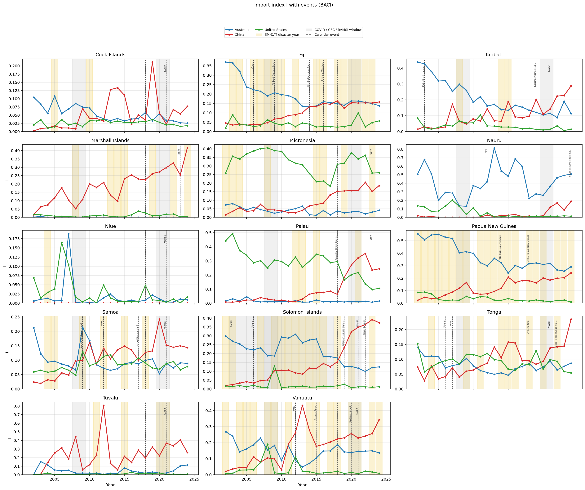
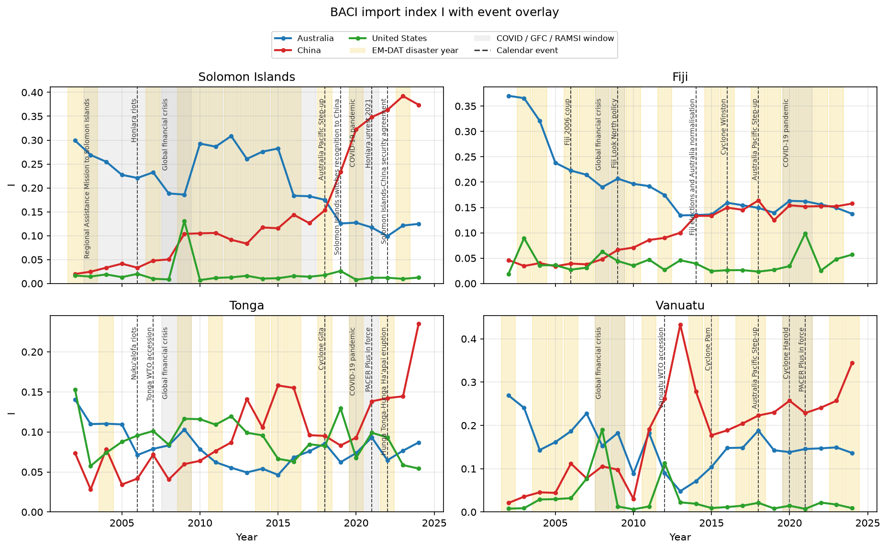
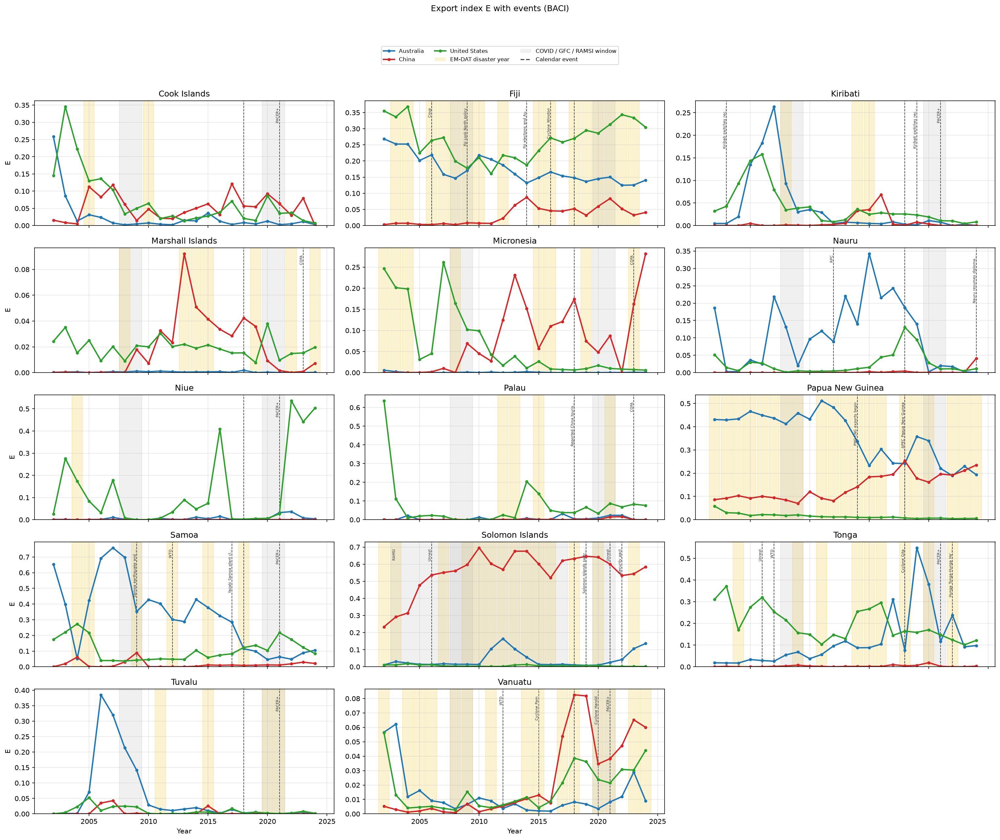
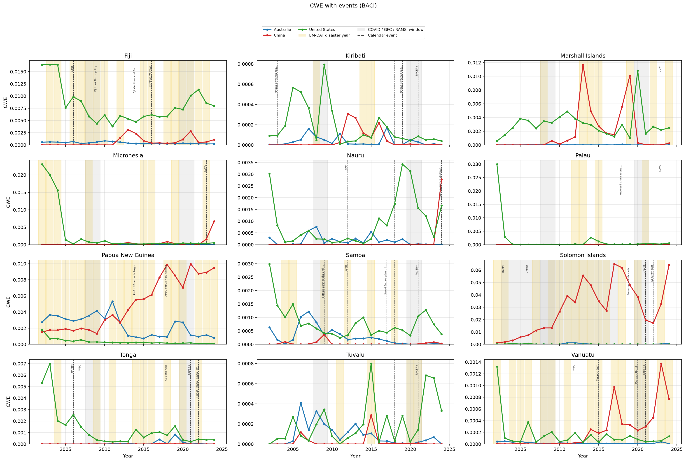
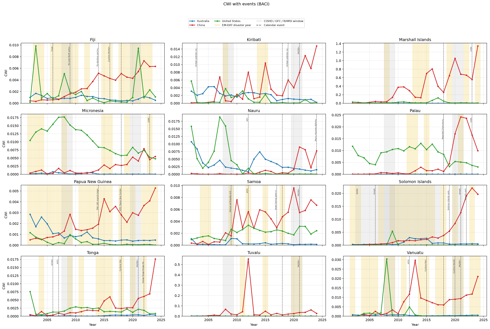

# Explaining BACI Influence-Index Peaks: Event Calendar, Lowy Aid, and EM-DAT

**Trade panel:** CEPII BACI HS02 V202601 influence indices (`I`, `E`, `CWI`, `CWE`), 14 Pacific Island Countries (PICs), partners Australia / China / United States, **2002–2024**  
**Overlay:** hand-coded PIC event calendar + Lowy Pacific Aid Map (via Pacific Data Hub `DF_PAM`) + EM-DAT country profiles  

---

## 1. Objectives

The BACI indices are complete for all 14 PICs and 23 years, but many series are spiky. The research question for this layer is:

> Which peaks, breaks, and partner re-rankings in PIC–AUS/CHN/US influence indices coincide with dated policy events, aid surges, or disasters; and which look like thin-trade or measurement artefacts?

| Goal | What this overlay does |
| ---- | ---------------------- |
| Narrative corroboration | Align calendar dummies, aid, and disasters with BACI indices |
| Attention map | Show *when* to look (2019 Solomon Islands–China imports; 2016 Fiji Winston) |
| Dataset choice | Use sources that share the PIC × year (× partner) grain |

---

## 2. Research process

### 2.1 Start from the index

Flag where “peaks” live in the BACI indices:

- **Solomon Islands–China E / CWE** is high from the mid-2000s (logs), not a one-year FTA shock.
- **Solomon Islands–China I** jumps after **2018** (0.15 → 0.23 in 2019 → 0.37 by 2024).
- **Cook Islands–China I** spikes in **2019** then falls.
- **Nauru–Australia I** and **Tuvalu–China I** are noisy; **Marshall Islands CWI** tracks ship-registry imports/GDP.
- Small-export PICs (Niue, Palau, Kiribati) produce **thin-denominator** E spikes.

So the overlay is designed to explain **a short list of credible series**, not every year-to-year jump.

### 2.2 Choose overlays that join on country x year x partner

Three layers were implemented:

| Layer | Grain after merge | Role |
| ----- | ----------------- | ---- |
| Hand-coded calendar | country × year × partner dummies | Named policy, diplomacy, disasters, commodity onsets |
| Lowy aid | country × year × partner spent/committed USD | Money from AUS / CHN / US in the same year |
| EM-DAT | country × year (copied to all three partners) | Recorded natural-disaster years |

All three left-join onto the **966** BACI index rows. Row count is preserved by construction.

---

## 3. Datasets

### 3.1 Chosen

#### 3.1.1 Hand-coded PIC calendar (41 events)

There is no clean machine-readable “Pacific diplomatic events” panel for 2002–2024. GDELT and ACLED count media mentions, not policy dates, and at annual PIC frequency they are too noisy to mark a 2019 Solomon Islands switch or a 2021 PACER Plus entry. So I built a small hand-coded CSV.

I started from the BACI index panel (14 PICs × 2002–2024 × Australia/China/US) and listed events that could reasonably coincide with a **level shift** in **I**, **E**, **CWI**, or **CWE**. Inclusion rules:

- Must date to a calendar year inside 2002–2024 (or overlap it; RAMSI starts 2003).
- Must name at least one of the 14 PICs, or apply to all of them (`country=*`).
- Must name Australia, China, or the US as the relevant partner, or apply to all three (`partner=*`).
- Must be independently dated from public sources (treaty EIF, recognition switch, named cyclone, mission start/end), not inferred from the trade series itself.

**Schema:** Eight columns, one row per event:

| Column | Role |
| ------ | ---- |
| `event_id` | Stable slug (`si_china_switch_2019`) |
| `year_start`, `year_end` | Inclusive span. Point events use the same year twice (Winston 2016). Multi-year regimes stay on for the whole window (RAMSI 2003–2017, PACER Plus 2021–2024, Step-up 2018–2024). |
| `country` | One PIC display name, or `*` for all 14 |
| `partner` | `aus`, `china`, `us`, or `*` for all three |
| `event_type` | Closed vocabulary (`diplomatic_switch`, `pacer_plus`, `disaster`, …) that becomes `flag_*` after expansion |
| `title`, `notes` | Short label for plots; dating caveat in notes |

**How wildcards expand:** The loader (`event_context/calendar.py`) clips each span to 2002–2024, then crosses countries × years × partners. `country=*` × `partner=*` (GFC, COVID) produces 14 × years × 3 rows. `country=*` × `partner=aus` (Step-up) produces 14 × years × 1. PACER Plus is **not** a wildcard: eight separate rows, partner Australia only, Fiji and PNG omitted because they are not parties. Nauru signed but has not ratified, so it is also omitted.

**What the 41 events actually are:** Three regional shocks (GFC 2008–09, COVID 2020–21, Australia Step-up 2018–). Eight PACER Plus members from first full year 2021. Four recognition switches (Kiribati→Taiwan 2003; Solomon Islands and Kiribati→China 2019; Nauru→China 2024). RAMSI, Honiara 2006/2021, SI–China security pact 2022. Fiji coup / sanctions / Look North / 2014 elections / Winston. Samoa tsunami, WTO, Yazaki closure. Tonga riots, WTO, Gita, Hunga Tonga. Vanuatu Pam, WTO, Harold. PNG LNG from 2014 and APEC 2018. Palau China tourism curbs 2018–19. Nauru RPC from 2012. COFA renewals 2023–24 for FSM, RMI, Palau.

**What I left out:** SPARTECA (already duty-free to Australia before 2002). Unratified PACER Plus (Nauru). China–PIC MoUs and forum communiqués without a dated goods-trade change. Sub-annual cabinet visits. Commodity licence years (Solomon Islands log export rules), those belong with HS-2 decomposition not this calendar. GDELT “event counts” as a substitute for dates.

The calendar is a **dating device**, not a causal treatment. Flags mark years when a named shock was on; they do not claim the index moved *because* of that shock.

#### 3.1.2 Lowy Pacific Aid Map, via SPC Pacific Data Hub `DF_PAM`

Lowy Institute’s Pacific Aid Map is the closest official **annual donor–recipient** series for the same 14 PICs. SPC republishes it as SDMX dataflow `DF_PAM` on Pacific Data Hub, which is what the overlay downloads.

**How to get the file (manual):** Open the SDMX REST CSV endpoint:

`https://stats-sdmx-disseminate.pacificdata.org/rest/data/SPC,DF_PAM,1.0/A..TRVAL..SPE+COM._T?dimensionAtObservation=AllDimensions&format=csvfile&startPeriod=2002&endPeriod=2024`

The key `A..TRVAL..SPE+COM._T` means: annual frequency, all recipients, indicator = transfer value (`TRVAL`), spent **and** committed (`SPE+COM`), all flow types (`_T`). Browser download, or `curl`/`requests` with a user-agent.

**Filters:** Keep `FREQ=A`, `INDICATOR=TRVAL`, `COMMITTED_SPENT` in `{SPE, COM}`, `FLOW_TYPE=_T`. Drop donor aggregates `_T`, `DONOR_BIL`, `DONOR_MUL`, `DONOR_CSP`, `DONOR_PCS` (those are totals, not Australia/China/US). Drop recipient `_T`. Map `GEO_PICT` ISO2 (`SB`, `FJ`, `FM`, …) to BACI display names; map donor `AU`/`CN`/`US` to `aus`/`china`/`us`. Sum to country–year–partner. Spent and committed stay in **separate** columns and are **never added**. `lowy_spent_share` is that donor’s share of named-donor spent for the recipient-year, not a GDP ratio.

#### 3.1.3 EM-DAT country profiles (HDX)

CRED/EM-DAT’s public **event-level** export needs a login. For annual index bands I only need country–year totals, which HDX publishes as **country profiles**.

**How to get the file (manual):** Dataset page: [EM-DAT country profiles on HDX](https://data.humdata.org/dataset/emdat-country-profiles). Direct resource used here (dated extract):

`https://data.humdata.org/dataset/74163686-a029-4e27-8fbf-c5bfcd13f953/resource/c5ce40d6-07b1-4f36-955a-d6196436ff6b/download/emdat-country-profiles_2026_09_02.xlsx`

The workbook has a header row plus an HXL tag row (`#country+name`, `#date+year`, …). pandas reads header=0; non-numeric `Year` rows (the HXL line) are dropped.

**Fiters:** Keep rows whose `ISO` is one of the 14 PIC ISO3 codes. Sum `Total Events`, `Total Affected`, `Total Deaths`, and `Total Damage (USD, original)` to country–year. Concatenate distinct `Disaster Type` values. Clip to 2002–2024. After the left join, a PIC-year with **no** EM-DAT row is filled as **0 events** (no disaster meeting EM-DAT inclusion criteria), except that **Nauru has no rows at all** in this extract. I treat Nauru disaster columns as structurally missing, not “always zero.” Cook Islands and Niue appear but are sparse.

### 3.2 Considered and not used

| Dataset | Why it is a weak fit *for peaks* | When it would be useful |
| ------- | -------------------------------- | ----------------------- |
| **PACER Plus / SPARTECA / DESTA / ARIC FTA lists** | SPARTECA already gave PIC exporters duty-free access to Australia **before 2002**. PACER Plus (in force 13 Dec 2020) mainly **binds existing zeros** and phases PIC *import* tariffs on Australian goods over 10–35 years. **Fiji and PNG are not parties.** China has no PIC goods FTA that dates a 2019 spike. | Slow Australia-I difference-in-differences after 2021, members vs Fiji/PNG |
| **UNCTAD TRAINS / CEPII MAcMap tariffs** | HS-6 × importer × year; BACI is HS02; small-PIC coverage is gappy; Australia MFN is already low | Partner applied duties on log/tuna/ore chapters after HS concordance |
| **NTMs (TRAINS, WTO I-TIP, Global Trade Alert)** | More plausible than tariffs for PIC *peaks* (Australia SPS, China log inspections, PIC export licences), but I-TIP only covers **WTO members** (Cook Islands, Kiribati, RMI, FSM, Nauru, Niue, Palau, Tuvalu drop out) | Targeted chapter study once HS-6 decomposition names the product |
| **GDELT / ACLED** | Event volume is media, not trade policy; Pacific coverage is thin | Not for annual I/E overlays |
| **Global Sanctions Database** | These PICs are rarely sanctioned | Fiji 2006–14 is in the **hand calendar** instead |
| **AidData China GCDF** | Project-level Chinese finance; complementary to Lowy, extra join cost | Construction-import spikes (Tuvalu, Cook Islands) |
| **World Bank Pink Sheet / WCPFC fish / forestry licences** | Best for **Solomon Islands CWE** (logs) and PNG LNG, not a general overlay | Next commodity-specific paper |

**FTA result in one line:** PACER Plus is in the calendar as a control, not as the peak decoder. Member Australia **I** does not jump up after 2021 (Table 7).

---

## 4. How the overlay is built

```
┌─────────────────────────────────────────────────────────────┐
│  indices_baci.csv   14 × 23 × 3 = 966 rows                  │
├─────────────────────────────────────────────────────────────┤
│  Calendar CSV → expand * → flag_* + event ids/titles        │
│  DF_PAM (Lowy) → spent/committed by AUS, CHN, US            │
│  EM-DAT profiles → country–year disaster totals             │
├─────────────────────────────────────────────────────────────┤
│  Left join on country, year, (partner)                      │
│  Lowy missing → NA (not zero). EM-DAT missing year → 0      │
└─────────────────────────────────────────────────────────────┘
```

**Calendar expansion.** `country=*` applies to all 14 PICs; `partner=*` applies to AUS, CHN, and US. Spans (RAMSI 2003–2017, PACER Plus 2021–2024) set the dummy every year in range. Point events (Winston 2016) set a single year.

**Aid.** PDH filter: annual `TRVAL`, spent (`SPE`) and committed (`COM`), all flow types, drop donor aggregates (`_T`, bilateral/multilateral totals). Recipient ISO2 (`SB`, `FJ`, …) maps to BACI display names. Donor `AU`/`CN`/`US` maps to `aus`/`china`/`us`. `lowy_spent_share` is that donor’s share of **named-donor** spent totals for the recipient-year (not GDP).

**Disasters.** HDX workbook, skip HXL tag row, keep PIC ISO3, sum events/affected/deaths/damage, concatenate disaster types. **Nauru has no EM-DAT rows** in this extract. Cook Islands and Niue appear but are sparse.

---

## 5. Coverage

**Table 1.** Overlay coverage on the BACI index panel

| Item | Value |
| ---- | ----- |
| Index rows (country × year × partner) | **966** |
| PICs | **14** |
| Calendar source events | **41** |
| Rows with ≥1 calendar flag | **335** (35%) |
| Rows with Lowy spent (this partner) | **574** (59%) |
| Rows with an EM-DAT disaster that year | **327** (34%) |
| Lowy retrieval | PDH SDMX `DF_PAM` (cached) |
| EM-DAT retrieval | HDX country profiles |

Aid is missing for many early years and for some China/US–PIC pairs: those cells stay **NA**. Disaster years without an EM-DAT record are **0**, which means “no event meeting EM-DAT criteria,” not “no weather.”

**Table 2.** Calendar events by type

| Type | Events | Typical content |
| ---- | -----: | --------------- |
| `pacer_plus` | 8 | In force 2021–2024; eight PIC parties; partner = Australia |
| `disaster` | 6 | Winston, Pam, Gita, Harold, Samoa 2009 tsunami, Hunga Tonga 2022 |
| `diplomatic_switch` | 4 | SI and Kiribati → China 2019; Kiribati → Taiwan 2003; Nauru → China 2024 |
| `engagement` | 4 | Fiji Look North / 2014 elections; PNG APEC; Palau tourism curbs |
| `wto_accession` | 3 | Tonga 2007; Samoa and Vanuatu 2012 |
| `compact_renewal` | 3 | US–FSM, RMI, Palau 2023–24 |
| `unrest` | 3 | Honiara 2006 and 2021; Nukuʻalofa 2006 |
| `commodity` | 2 | PNG LNG 2014–; Yazaki Samoa closure 2017 |
| Other (one each) | 8 | GFC, COVID, Step-up, RAMSI, Fiji coup, sanctions, RPC, SI–China security pact |

Three regional events (`*`) hit every PIC: GFC 2008–09, COVID 2020–21, Australia Step-up 2018–24 (Australia partner only).

**Table 3.** Dummy counts on the 966-row panel (a row can carry several flags)

| Flag | Rows = 1 | Interpretation |
| ---- | -------: | -------------- |
| `flag_step_up` | 98 | 14 PICs × 7 years × Australia |
| `flag_gfc` | 84 | 14 × 2 × 3 partners |
| `flag_covid` | 84 | 14 × 2 × 3 |
| `flag_commodity` | 34 | PNG LNG span + Samoa Yazaki |
| `flag_pacer_plus` | 32 | 8 members × 4 years × Australia |
| `flag_disaster` | 18 | Six named disaster years × 3 partners |
| `flag_ramsi` | 15 | Solomon Islands × Australia, 2003–2017 |
| `flag_diplomatic_switch` | 14 | SI/Kiribati post-2019 + Kiribati 2003 + Nauru 2024 |
| `flag_processing_centre` | 13 | Nauru–Australia RPC from 2012 |
| Smaller flags | ≤12 | Engagement, sanctions, WTO, unrest, COFA, security pact, coup |

---

## 6. Lowy aid (Australia, China, United States)

PDH `DF_PAM` in this run spans **2002–2024** (wider than the Lowy website’s 2008–2024 narrative). Values are current USD as reported by the source.

**Table 4.** Sum of Lowy spent and committed, PIC recipients, 2002–2024

| Donor (index partner) | Spent (USD) | Committed (USD) |
| --------------------- | ----------: | --------------: |
| Australia | **16.3 billion** | 18.0 billion |
| China | **4.1 billion** | **9.3 billion** |
| United States | **3.3 billion** | 4.2 billion |

China’s **committed** total is more than double **spent**: large infrastructure pledges that disburse slowly. Spent is the better annual overlay for trade-year shocks.

**Table 5.** Mean annual spent by recipient and donor (USD; years with a row)

| Country | Australia | China | United States |
| --- | ---: | ---: | ---: |
| Papua New Guinea | 486,025,376 | 104,916,505 | 8,654,505 |
| Solomon Islands | 161,178,170 | 24,840,314 | 2,279,389 |
| Fiji | 54,324,920 | 21,792,988 | 2,343,279 |
| Vanuatu | 53,745,084 | 23,818,461 | 6,153,697 |
| Samoa | 29,325,768 | 21,096,962 | 1,107,061 |
| Tonga | 25,126,653 | 20,068,623 | 1,330,758 |
| Kiribati | 21,306,742 | 17,896,684 | 369,025 |
| Nauru | 21,309,378 | — | — |
| Micronesia | 3,986,560 | 14,671,241 | **88,492,923** |
| Marshall Islands | 2,914,731 | — | **56,838,074** |
| Palau | 3,919,839 | — | **14,069,186** |
| Cook Islands | 3,116,152 | 5,645,620 | 36,340 |
| Tuvalu | 8,245,214 | — | 73,296 |
| Niue | 2,223,342 | 893,750 | 63,382 |

Australia dominates Melanesian **spent**. The US Compact states (Micronesia, Marshall Islands, Palau) are a **US aid** story, matching the US import-index sphere. Several China–PIC spent series are empty in Lowy (Marshall Islands, Nauru, Palau, Tuvalu): do not read those as zero Chinese activity.

---

## 7. EM-DAT disasters

**Table 6.** PIC disaster totals in EM-DAT country profiles, 2002–2024

| Country | Event-years summed | Deaths | People affected |
| --- | ---: | ---: | ---: |
| Papua New Guinea | 51 | 1,310 | 3,805,453 |
| Fiji | 28 | 154 | 1,505,376 |
| Vanuatu | 23 | 42 | 1,147,988 |
| Solomon Islands | 20 | 189 | 326,834 |
| Tonga | 11 | 17 | 208,689 |
| Micronesia | 9 | 53 | 267,032 |
| Marshall Islands | 8 | 0 | 66,280 |
| Samoa | 6 | 170 | 18,287 |
| Palau, Tuvalu, Kiribati, Cook Islands, Niue | 1–4 | few | small |
| **Nauru** | **0** | — | not in extract |

Largest affected-year cells include PNG 2015 drought/flood/storm (~2.5 million), Vanuatu 2023 storms, Fiji 2016 (Winston), PNG 2018 earthquake/volcano. These are the gold bands on the plots. Calendar-named disasters (Winston, Pam, Hunga Tonga) are a **subset** of EM-DAT years, kept for labels.

---

## 8. Findings

### 8.1 Import index with overlay (all PICs)



Country-specific labels (PACER+, RAMSI, Coup, Switch to China, Cyclone Pam, …) are rotated at onset years. GFC, COVID, and Australia Step-up are **not** labelled on every panel; they appear as grey bands / legend so 14 small charts stay readable.

**Fingings:**

- China’s **I** rises in most PICs after ~2010. The 2019 diplomatic switches sit on **already rising** China import shares in Solomon Islands and Kiribati, then the slope steepens.
- Australia **I** starts high in Fiji, Kiribati, Nauru, PNG, Solomon Islands and eases as China rises. PACER Plus (2021) does not reverse that.
- The US remains the main import partner for **Micronesia**; Palau’s US I falls while China I rises.

### 8.2 Worked import-index cases



**Solomon Islands–China imports (the clearest policy coincidence).**

| Year | China I | China E | China CWE | Lowy China spent (USD) | Diplomatic-switch flag |
| ---: | ---: | ---: | ---: | ---: | --- |
| 2018 | 0.153 | 0.632 | 0.062 | — | 0 |
| 2019 | **0.233** | 0.646 | 0.048 | **10.2 million** | 1 |
| 2020 | 0.323 | 0.641 | 0.038 | 12.6 million | 1 |
| 2021 | 0.348 | 0.600 | 0.020 | **41.1 million** | 1 |
| 2024 | 0.374 | 0.585 | 0.064 | 29.0 million | 1 |

Exports to China were already ~0.55–0.70 from logging **before** 2019. The **import** share and **recorded Chinese aid spent** move together after the switch. That is corroboration, not identification: COVID and 2021 unrest overlap the same window.

**Kiribati–China I** is 0.10 in 2018, **0.20 in 2019**, then volatile and **0.29 in 2024**. Export shares to China stay near zero: this is an **import/aid** story, not logs.

**Fiji.** Australia I falls from 0.24 (2005) to 0.14 (2014) across the coup/sanctions years while China I rises from 0.03 to 0.13 (Look North). By 2024 China I (0.16) slightly exceeds Australia (0.14). Cyclone Winston (2016) is an EM-DAT storm year with a mild Australia I rebound (0.16), consistent with reconstruction sourcing, not a partner-regime change.

**Tonga 2022 (Hunga Tonga).** China I is already above Australia before the eruption (0.14 vs 0.07 in 2021) and stays higher; 2024 China I reaches **0.24**. The disaster year is a reconstruction overlay on a prior China-import trend.

**Vanuatu / Cyclone Pam (2015).** China I is **already high in 2014 (0.28)** and *falls* in 2015 (0.18) while Australia I rises (0.07 → 0.10). Pam is not a simple “China import spike” year in BACI I.

### 8.3 Export index and CWE





- **Solomon Islands–China E** is a **commodity** series (logs, China as buyer). Calendar diplomacy explains **I** better than **E**.
- **PNG LNG (2014–).** Australia E falls 0.43 (2013) → 0.34 (2014) → 0.19 (2024); China E rises 0.12 → 0.14 → 0.24. CWE is larger for China than Australia in every year shown, because of China’s world import share - the same ranking as the main BACI report.
- **Samoa–Australia E** decline and the 2017 Yazaki closure are in the calendar; treat small-PIC E spikes (Niue, Palau) as thin trade unless HS-2 agrees.

### 8.4 CWI



CWI remains dominated by **Marshall Islands–China** (imports ≫ GDP) and, among credible \(M/Y\) series, **Micronesia/Palau–US**. Compact-renewal flags in 2023–24 mark aid, not a CWI break. Do not overlay CWI peaks with diplomacy without first dropping Marshall Islands.

### 8.5 PACER Plus is not the peak decoder

**Table 7.** Australia import index I, 2018 / 2021 / 2024

| Country | PACER Plus party? | I 2018 | I 2021 | I 2024 |
| --- | --- | ---: | ---: | ---: |
| Cook Islands | Yes | 0.058 | 0.032 | 0.025 |
| Kiribati | Yes | 0.134 | 0.115 | 0.114 |
| Niue | Yes | 0.008 | 0.003 | 0.009 |
| Samoa | Yes | 0.099 | 0.089 | 0.089 |
| Solomon Islands | Yes | 0.175 | 0.117 | 0.125 |
| Tonga | Yes | 0.086 | 0.093 | 0.087 |
| Tuvalu | Yes | 0.019 | 0.021 | 0.113 |
| Vanuatu | Yes | 0.188 | 0.145 | 0.136 |
| Fiji | **No** | 0.149 | 0.162 | 0.138 |
| Papua New Guinea | **No** | 0.317 | 0.319 | 0.291 |

Among members, Australia’s import **share** generally **falls or is flat** after entry into force. Tuvalu 2024 is a small-denominator jump, not a liberalisation fingerprint. Fiji and PNG (controls) also do not show a 2021 Australia-I break. PACER Plus stays in the file as a **slow-trend control**, consistent with SPARTECA already covering PIC exports to Australia before the BACI sample.

---

## 9. Limitations

1. **Annual frequency** smears September 2019 switches into calendar year 2019; PACER Plus in force mid-December 2020 is coded from **2021**.
2. **EM-DAT thresholds** omit smaller local disasters; Nauru is absent.
3. **Lowy spent vs committed** must not be added; latest years can be incomplete; some PIC–China series have no spent rows.
4. **Hand calendar** is incomplete by design (41 events). Logging licences, SPS bans, and one-off construction cargoes are mostly missing.
5. **No HS-6 join in this module.** Chapter decomposition remains the first “why this peak” test.
6. Plots label **one event per year** on the 14-country grid (point events beat spans) so 2021 Solomon Islands shows unrest, not PACER+.
