# UN Comtrade vs IMF Trade Data Discrepancy Analysis

## 1. Objectives and research hypothesis

### 1.1 Objectives

Quantify and visualize discrepancies between two international trade data sources:

| Source          | Folder / file                        | Time coverage                 |
| --------------- | ------------------------------------ | ----------------------------- |
| **UN Comtrade** | `data/COMMTRADE data/`               | 2013–2024 (varies by country) |
| **IMF DOTS**    | `data/IMF data/IMF_Pacific_DOTS.csv` | 2000–2024                     |

### 1.2 Hypothesis

> *Significant discrepancies (temporal and otherwise) exist between UN Comtrade and IMF data for comparable variables, which limits the reliability of these sources.*

The analysis tests this hypothesis across **5 dimensions**: data coverage, discrepancy magnitude, temporal trends, trade partners, and trade flow direction.

---

## 2. Analytical framework

The analysis is organized in **5 layers**:

```
┌─────────────────────────────────────────────────────────────┐
│  Layer 1: Coverage & comparability                          │
├─────────────────────────────────────────────────────────────┤
│  Layer 2: Data harmonization                                │
├─────────────────────────────────────────────────────────────┤
│  Layer 3: Discrepancy magnitude                             │
├─────────────────────────────────────────────────────────────┤
│  Layer 4: Temporal discrepancies                            │
├─────────────────────────────────────────────────────────────┤
│  Layer 5: Structural decomposition                          │
│  → country × flow × partner                                 │
└─────────────────────────────────────────────────────────────┘
```

### 2.1 Analysis dimensions

| Dimension   | Description                | Comparison keys              |
| ----------- | -------------------------- | ---------------------------- |
| **Time**    | Reporting year             | `year` / `time_period`       |
| **Country** | Reporting economy          | 7 Pacific countries          |
| **Flow**    | Export or import           | `export` / `import`          |
| **Partner** | Trade partner              | `world`, `aus`, `china`      |
| **Value**   | Trade value (millions USD) | CIF (imports), FOB (exports) |

### 2.2 Comparison priority

1. **World totals** — most direct aggregate comparison between sources
2. **Bilateral Australia / China** — when Comtrade has matching partner data
3. **Bilateral USA** — *not comparable* with the current Comtrade extract (no USA partner data)

---

## 3. Input data

### 3.1 UN Comtrade

- **Granularity:** HS 4-digit code × bilateral partner × flow × year  
- **Files used:** 7 `*_panel2.csv` files matching IMF countries  
- **Partners in extract:** `AUS` (Australia), `CHN` (China), `W00` (World)  
- **Value fields:** `cifvalue__US__` (imports), `fobvalue__US__` (exports), `primaryValue__US__` (fallback)

### 3.2 IMF Pacific DOTS

- **Granularity:** Country × year × partner (Australia, China, USA, World)  
- **Units:** Millions USD  
- **12 Pacific countries** in the IMF file; only **7** have matching Comtrade data

### 3.3 Country name mapping

| Comtrade (`reporterDesc`)          | IMF (`country`)    |
| ---------------------------------- | ------------------ |
| Fiji                               | Fiji, Republic of  |
| Kiribati                           | Kiribati           |
| Palau                              | Palau, Republic of |
| Papua New Guinea                   | Papua New Guinea   |
| Samoa                              | Samoa              |
| Solomon Isds → **Solomon Islands** | Solomon Islands    |
| Tonga                              | Tonga              |

> **Note:** Comtrade records `Solomon Isds` (typo); source code normalizes to `Solomon Islands` before merging.

---

## 4. Data harmonization procedure

### 4.1 Comtrade value extraction

For each HS 4-digit record:

- **Imports** (`flowCode = M`): use CIF; if missing, use `primaryValue`
- **Exports** (`flowCode = X`): use FOB; if missing, use `primaryValue`

### 4.2 Comtrade aggregation

- **World totals:** filter `partnerISO = 'W00'`, sum all HS codes by `(country, year, flow)`  
  - Do *not* sum bilateral partners (AUS + CHN) to approximate world — the extract covers only a subset of partners
- **Bilateral:** filter `partnerISO ∈ {AUS, CHN}`, sum by the same keys  
- **Unit conversion:** divide by 1,000,000 to obtain millions USD

### 4.3 IMF long-format conversion

Each IMF row (country × year) is reshaped into up to 8 observations:

`(export, world)`, `(import, world)`, `(export, aus)`, `(import, aus)`, `(export, china)`, `(import, china)`, `(export, us)`, `(import, us)`

Blank cells are treated as missing (not imputed as zero).

### 4.4 Source merge (inner join)

Merged on:

```
(country, year, flow, partner)
```

Only observations **present in both sources** are retained → **244 comparable observations**.

---

## 5. Implemented formulas

Implemented in `trade_discrepancy/metrics.py` and `trade_discrepancy/harmonize.py`.

### 5.1 Comtrade trade value (USD)

$$
V_{i,t,f,p}^{\text{Comtrade}} =
\begin{cases}
\text{CIF}_{i,t,f,p} & \text{if } f = \text{import} \text{ and CIF is available} \\
\text{FOB}_{i,t,f,p} & \text{if } f = \text{export} \text{ and FOB is available} \\
\text{primaryValue}_{i,t,f,p} & \text{otherwise}
\end{cases}
$$

Where: $i$ = country, $t$ = year, $f$ = flow, $p$ = partner.

Aggregation:

$$
V_{i,t,f,p}^{\text{Comtrade, agg}} = \sum_{h \in \text{HS4}} V_{i,t,f,p,h}
$$

Conversion to millions USD:

$$
V_{i,t,f,p}^{\text{Comtrade (MUSD)}} = \frac{V_{i,t,f,p}^{\text{Comtrade, agg}}}{10^6}
$$

### 5.2 Absolute difference

$$
\Delta_{i,t,f,p} = V_{i,t,f,p}^{\text{IMF}} - V_{i,t,f,p}^{\text{Comtrade}}
$$

Units: millions USD. A positive value means IMF exceeds Comtrade.

### 5.3 sMAPE - Symmetric Mean Absolute Percentage Error

$$
\text{SymDiff\%}_{i,t,f,p} =
\begin{cases}
\dfrac{\Delta_{i,t,f,p}}{\dfrac{\left|V_{i,t,f,p}^{\text{IMF}}\right| + \left|V_{i,t,f,p}^{\text{Comtrade}}\right|}{2}} \times 100\% & \text{if denominator} > 0 \\[6pt]
\text{NA} & \text{if both are zero}
\end{cases}
$$

**Advantage:** Symmetric around zero; more stable than ordinary percentage error for small Pacific trade flows.

**Tolerance threshold:** $|\text{SymDiff\%}| \leq 5\%$ (`DISCREPANCY_TOLERANCE_PCT = 5.0`).

### 5.4 Log ratio

$$
\text{LogRatio}_{i,t,f,p} = \ln\!\left(\frac{V_{i,t,f,p}^{\text{IMF}}}{V_{i,t,f,p}^{\text{Comtrade}}}\right)
$$

Computed only when both values are positive.

### 5.5 Summary statistics

By group $(i, f, p)$:

| Metric | Formula |
| ------ | ------- |
| Observations | $N_{i,f,p}$ |
| Mean absolute difference | $\overline{\|\Delta\|}_{i,f,p}$ |
| Median SymDiff% | $\text{median}(\text{SymDiff\%})$ |
| Mean SymDiff% | $\overline{\text{SymDiff\%}}_{i,f,p}$ |
| Max \|SymDiff%\| | $\max(\|\text{SymDiff\%}\|)$ |
| Share within 5% | $\dfrac{\#\{\|\text{SymDiff\%}\| \leq 5\%\}}{N_{i,f,p}}$ |

By year $(t, f, p)$: same metrics grouped by year instead of country.

---

## 6. Analysis results

### 6.1 Data coverage

| Country | Comtrade | IMF | Overlap years | Comparison period |
| ------- | -------- | --- | ------------- | ----------------- |
| Fiji | 2013–2024 | 2000–2024 | **12** | 2013–2024 |
| Samoa | 2013–2023 | 2000–2024 | **10** | 2013–2023 |
| Kiribati | 2014–2021 | 2000–2024 | **7** | 2014–2021 |
| Palau | 2014–2018 | 2000–2024 | **5** | 2014–2018 |
| Solomon Islands | 2015–2018 | 2000–2024 | **4** | 2015–2018 |
| Papua New Guinea | 2019–2021 | 2000–2024 | **3** | 2019–2021 |
| Tonga | 2013–2014 | 2000–2024 | **2** | 2013–2014 |

**Notes:**

- IMF covers 25 years (2000–2024); Comtrade covers only 2–12 years depending on country  
- Tonga has only 2 overlapping years → very limited statistical inference  
- 5 IMF countries (Vanuatu, Tuvalu, Marshall Islands, Micronesia, Nauru) have **no** Comtrade data in this extract

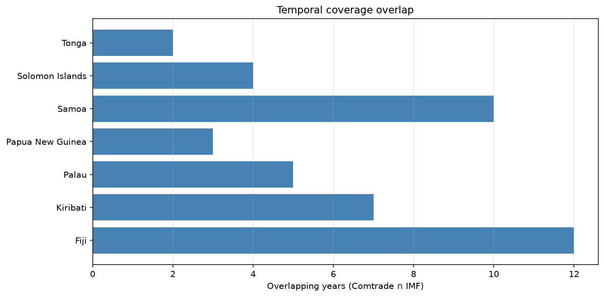

### 6.2 Headline metrics

| Metric                        | Value      |
| ----------------------------- | ---------- |
| Total comparable observations | **244**    |
| World-total observations      | **86**     |
| Median SymDiff% (world)       | **−0.18%** |
| Mean |SymDiff%| (world)       | **16.95%** |
| Share of world within ±5%     | **50.0%**  |

| Partner         | Observations | Median SymDiff% | Share within ±5% |
| --------------- | ------------ | --------------- | ---------------- |
| World           | 86           | −0.18%          | 50%              |
| Australia (aus) | 85           | −0.01%          | 72%              |
| China (china)   | 73           | ~0%             | 66%              |

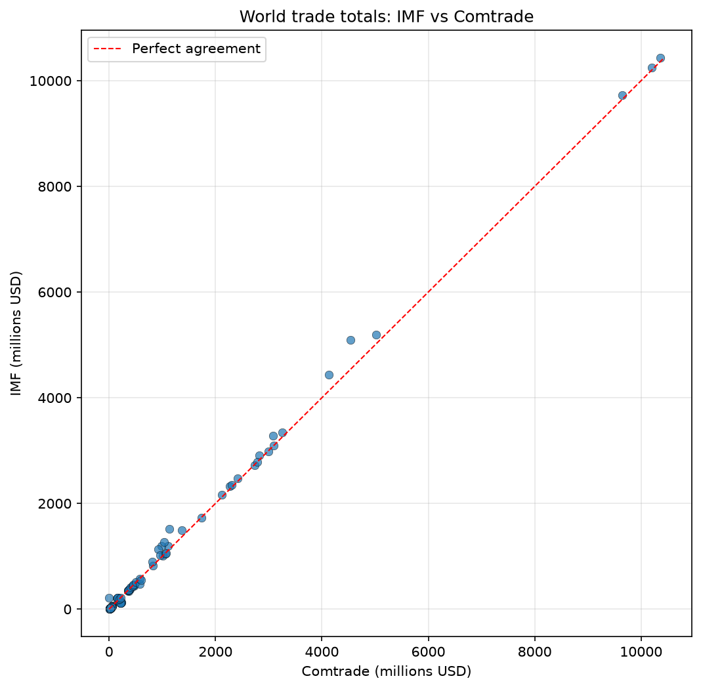

*Points on the red dashed line indicate perfect agreement. Systematic outliers (e.g. Kiribati, Palau) pull away from the 45° line.*

### 6.3 Results by country, flow, and partner

#### Countries with strong agreement

| Country              | Flow              | Partner           | Median SymDiff% | Share ±5% |
| -------------------- | ----------------- | ----------------- | --------------- | --------- |
| **Fiji**             | Import            | Australia         | −0.04%          | 100%      |
| **Fiji**             | Import            | China             | −0.04%          | 100%      |
| **Fiji**             | Export            | Australia         | ~0%             | 100%      |
| **Papua New Guinea** | Export            | World             | 0.61%           | 100%      |
| **Solomon Islands**  | Export            | AUS / CHN / World | < 1%            | 100%      |
| **Tonga**            | Bilateral AUS/CHN | —                 | < 1%            | 100%      |

> **Typical example:** Fiji imports from Australia in 2013 — Comtrade ≈ 383.63 MUSD, IMF ≈ 383.63 MUSD (near-zero error).

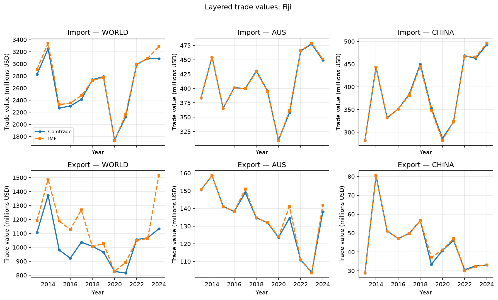

#### Countries with large, systematic gaps

| Country             | Flow   | Partner | Median SymDiff%  | Share ±5% | Comment                                             |
| ------------------- | ------ | ------- | ---------------- | --------- | --------------------------------------------------- |
| **Kiribati**        | All    | All     | **−55% to −67%** | 0–14%     | Large negative gap; possible unit or scope mismatch |
| **Palau**           | Import | World   | **+31.7%**       | 0%        | Some years Comtrade ≈ 0, IMF reports large values   |
| **Palau**           | Import | AUS/CHN | up to **±200%**  | 80%       | Small values; sensitive to tiny absolute errors     |
| **PNG**             | Import | China   | **+30.8%**       | 0%        | Only 3 observation years                            |
| **Solomon Islands** | Import | China   | **+48.2%**       | 0%        | Structural gap at China partner                     |
| **Samoa**           | Import | China   | **−21.7%**       | 30%       | Moderate gap                                        |

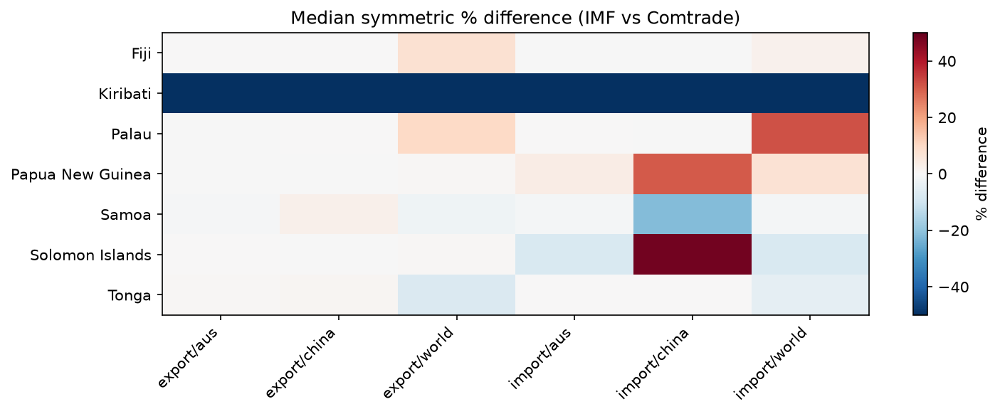

*Red = IMF above Comtrade; blue = IMF below Comtrade. Kiribati shows a deep blue band across partners; Palau imports world stand out in red.*

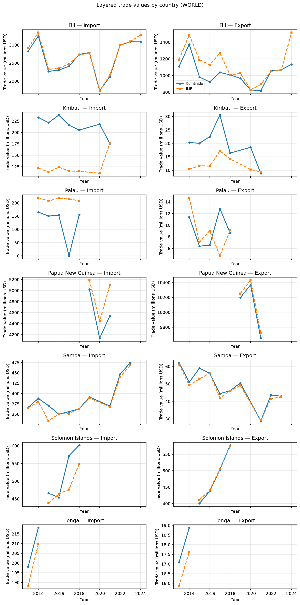

*Comtrade (solid) vs IMF (dashed) world totals over overlapping years — Fiji tracks closely; Kiribati and Palau diverge sharply.*

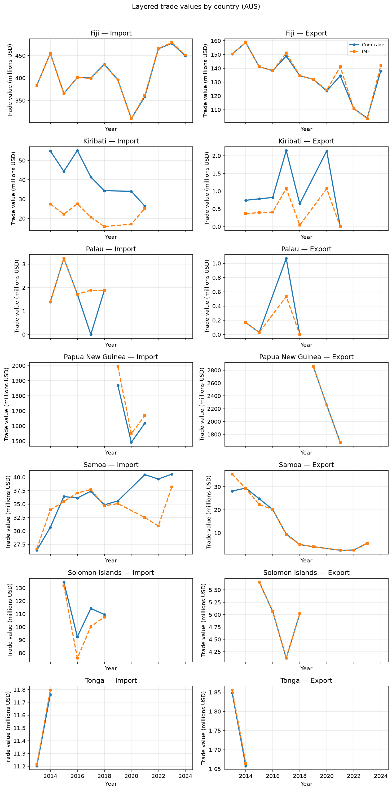

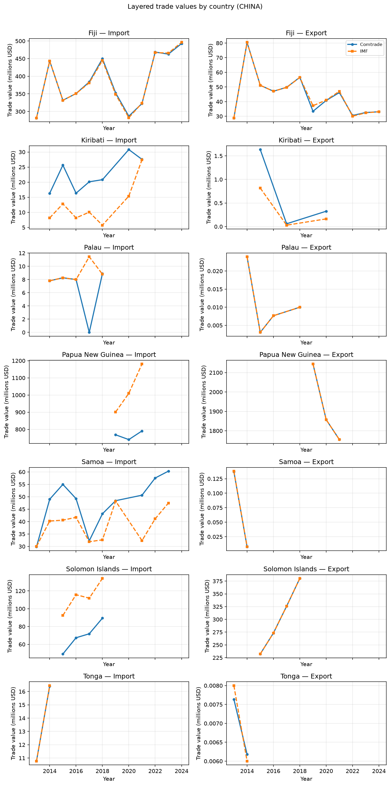

*Bilateral Australia/China overlays show closer tracking than world totals for most countries (except Kiribati’s systematic ~2× gap).*

### 6.4 Ten largest discrepancies (world totals)

| Country  | Year | Flow   | Comtrade (MUSD) | IMF (MUSD) | SymDiff%   |
| -------- | ---- | ------ | --------------- | ---------- | ---------- |
| Palau    | 2017 | Import | 0.00            | 214.18     | **+200%**  |
| Palau    | 2017 | Export | 12.84           | 4.71       | **−92.6%** |
| Kiribati | 2020 | Import | 218.07          | 110.45     | **−65.5%** |
| Kiribati | 2015 | Import | 221.46          | 113.16     | **−64.7%** |
| Kiribati | 2014 | Export | 20.32           | 10.42      | **−64.4%** |
| Kiribati | 2016 | Export | 22.51           | 11.54      | **−64.4%** |
| Kiribati | 2016 | Import | 237.99          | 123.85     | **−63.1%** |
| Kiribati | 2014 | Import | 232.96          | 122.06     | **−62.5%** |
| Kiribati | 2017 | Import | 215.77          | 115.54     | **−60.5%** |
| Kiribati | 2020 | Export | 18.54           | 10.28      | **−57.4%** |

**Kiribati pattern:** Comtrade is often ~2× IMF (SymDiff% ≈ −66.7% when one source doubles the other) → suggests a **systematic issue** (units, commodity scope, or aggregation method), not random noise.

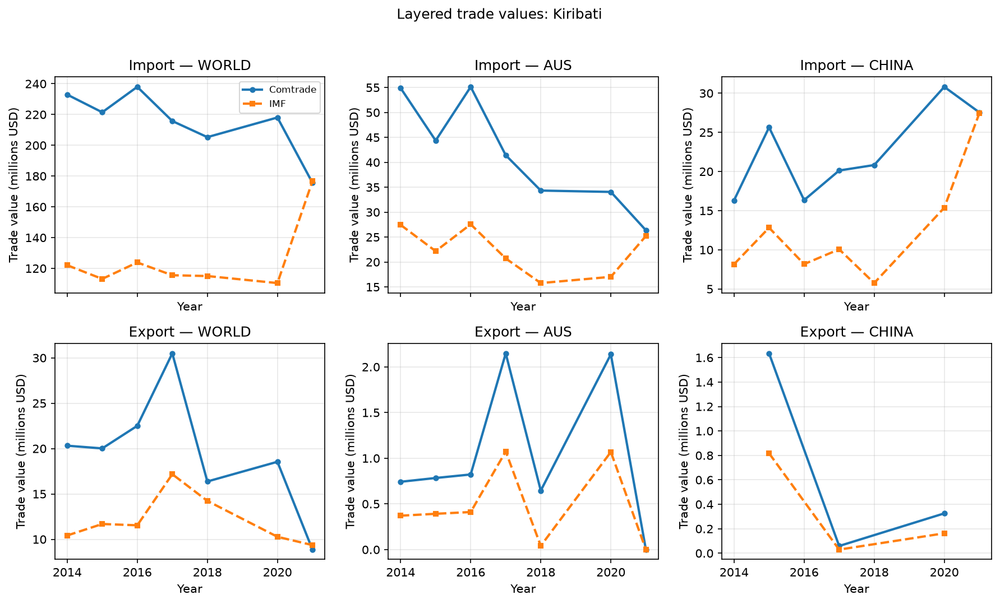

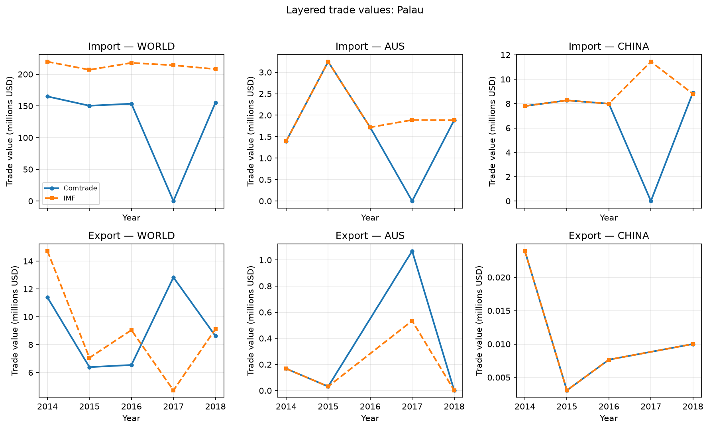

### 6.5 Temporal trends (world totals)

| Year | Median SymDiff% | Share ±5% | Observations |
| ---- | --------------- | --------- | ------------ |
| 2013 | −1.0% | 50% | 6 |
| 2014 | −2.7% | 40% | 10 |
| 2015 | −1.9% | 20% | 10 |
| 2016 | +1.4% | 50% | 10 |
| 2017 | −3.5% | 30% | 10 |
| 2018 | −0.3% | 50% | 10 |
| 2019 | +0.08% | 83% | 6 |
| 2020 | −0.09% | 50% | 6 |
| 2021 | +1.4% | 63% | 8 |
| 2022 | −1.0% | **100%** | 4 |
| 2023 | −0.8% | **100%** | 4 |
| 2024 | +17.5% | **0%** | 2 |

**Temporal notes:**

- 2014–2017: low share within 5% (20–40%), driven by Kiribati and Palau  
- 2022–2023: strong agreement (100% within ±5%) but only 4 observations  
- 2024: large gap (+17.5%) but only 2 countries (Fiji, Kiribati) — interpret with caution

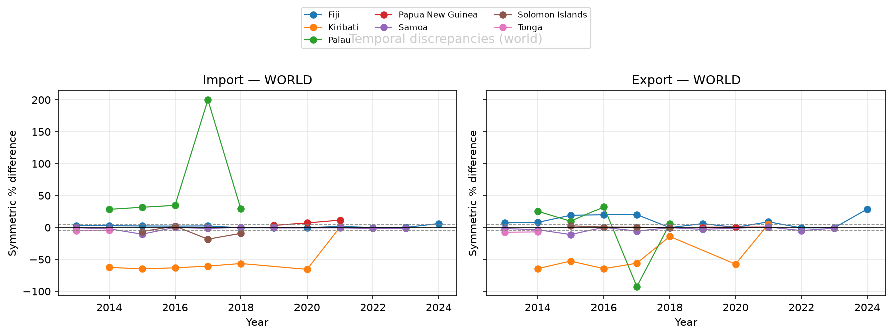

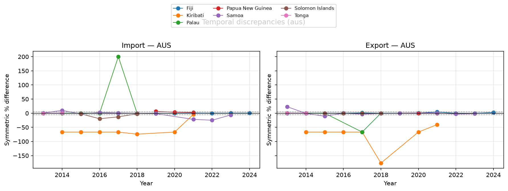

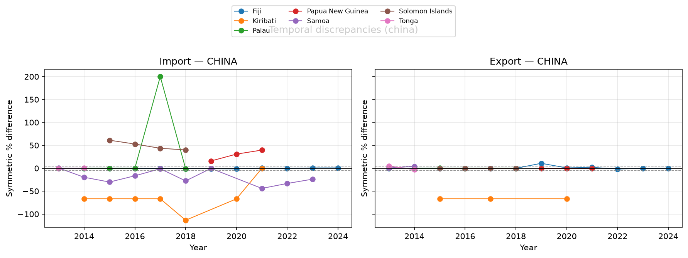

*Gray dashed lines mark the ±5% tolerance band. Bilateral Australia/China series stay closer to zero than world totals for most countries.*

### 6.6 Output charts

All PNG files are saved under `outputs/trade_discrepancy/plots/`:

| File | Description |
| ---- | ----------- |
| `scatter_world_totals.png` | IMF vs Comtrade scatter (world totals) |
| `heatmap_median_discrepancy.png` | Heatmap of median SymDiff% by country × flow × partner |
| `coverage_overlap_years.png` | Overlapping years per country |
| `layered_values_overview_world.png` | Comtrade vs IMF world totals by country |
| `layered_values_overview_aus.png` | Comtrade vs IMF Australia bilateral by country |
| `layered_values_overview_china.png` | Comtrade vs IMF China bilateral by country |
| `layered_values_fiji.png` | Per-country panel (strong agreement) |
| `layered_values_kiribati.png` / `layered_values_palau.png` | Per-country panels (large gaps) |
| `layered_values_*.png` | Remaining country panels (PNG, Samoa, Solomon Islands, Tonga) |
| `timeseries_world.png` | SymDiff% over time (world) |
| `timeseries_aus.png` | SymDiff% over time (bilateral Australia) |
| `timeseries_china.png` | SymDiff% over time (bilateral China) |

### 6.7 Output files

| File | Content |
| ---- | ------- |
| `comparison_metrics.csv` | 244 rows — observation-level discrepancy metrics |
| `summary_by_country_flow_partner.csv` | Aggregated stats by country / flow / partner |
| `summary_by_partner.csv` | Headline stats by partner (world / aus / china) |
| `summary_by_year.csv` | Aggregated stats by year |
| `coverage_summary.csv` | Temporal overlap table |
| `largest_world_discrepancies.csv` | Top world-total SymDiff% gaps |

The CLI script and notebook both call `trade_discrepancy.pipeline.run_analysis`, which writes these **6 CSV files** and the core PNG charts to `outputs/trade_discrepancy/csv/` and `outputs/trade_discrepancy/plots/`.

---

## 7. Interpretation and hypothesis assessment

### 7.1 Main conclusions

The hypothesis is **partially supported, in a context-dependent way**:

1. **Discrepancies are not uniform.** Some combinations (Fiji–Australia, Fiji–China, PNG export world) match almost perfectly. Others (Kiribati, Palau) show large, systematic gaps.
2. **Bilateral series agree better than world totals.** Share within ±5%: Australia 72%, China 66%, world 50%. This suggests aggregation scope at the *world* level may differ more than at the bilateral level.
3. **Reliability is country-specific.** Neither source can be declared universally more accurate; assessment must be done by country, flow, and partner.
4. **Kiribati has a serious data issue.** SymDiff% ≈ −66.7% suggests a systematic error — **further investigation required before using either source for Kiribati**.

### 7.2 Assessment against the original hypothesis

| Hypothesis aspect | Assessment |
| ----------------------------- | ---------------------------------------------------------------------------------------- |
| **Significant discrepancies** | **Yes** — especially Kiribati, Palau, Solomon Islands (China imports) |
| **Temporal discrepancies** | **Yes** — varies by year; 2014–2017 worse than 2019–2023 |
| **Limits source reliability** | **Yes, but not universally** — Fiji and PNG (exports) remain reliable at aggregate level |

---

## 8. Limitations

| Limitation                               | Impact                                                      |
| ---------------------------------------- | ----------------------------------------------------------- |
| Comtrade has only AUS, CHN, W00 partners | Cannot compare bilateral USA                                |
| Short, uneven Comtrade time coverage     | 244 observations; some countries have only 2–3 years        |
| IMF has many blank cells                 | Reduces bilateral observations (especially China for Samoa) |
| No vintage / revision data               | Cannot test late-revision effects                           |
| 5% threshold is arbitrary                | Results sensitive to threshold choice                       |

---

## 9. Reproducing results

### Run the analysis script

```powershell
cd d:\my-phd\my-code\research-assistant
.\.venv\Scripts\python.exe scripts\run_trade_discrepancy_analysis.py
```

### Run the interactive notebook

Open `notebooks/trade_discrepancy_analysis.ipynb` and run all cells.

### Run tests

```powershell
.\.venv\Scripts\python.exe -m pytest tests\ -v
```

### Source code structure

```
trade_discrepancy/
├── constants.py           # Country/partner mappings, paths
├── pipeline.py            # Shared run_analysis() for CLI + notebook
├── harmonize.py           # Harmonization and merge
├── loaders.py             # CSV loading
├── metrics.py             # Discrepancy formulas
└── visualize.py           # Charts

scripts/run_trade_discrepancy_analysis.py   # thin CLI wrapper around pipeline.run_analysis
notebooks/trade_discrepancy_analysis.ipynb  # same pipeline + interactive displays
tests/test_trade_discrepancy.py
outputs/trade_discrepancy/
├── csv/                       # CSV outputs
└── plots/                     # PNG charts
```
