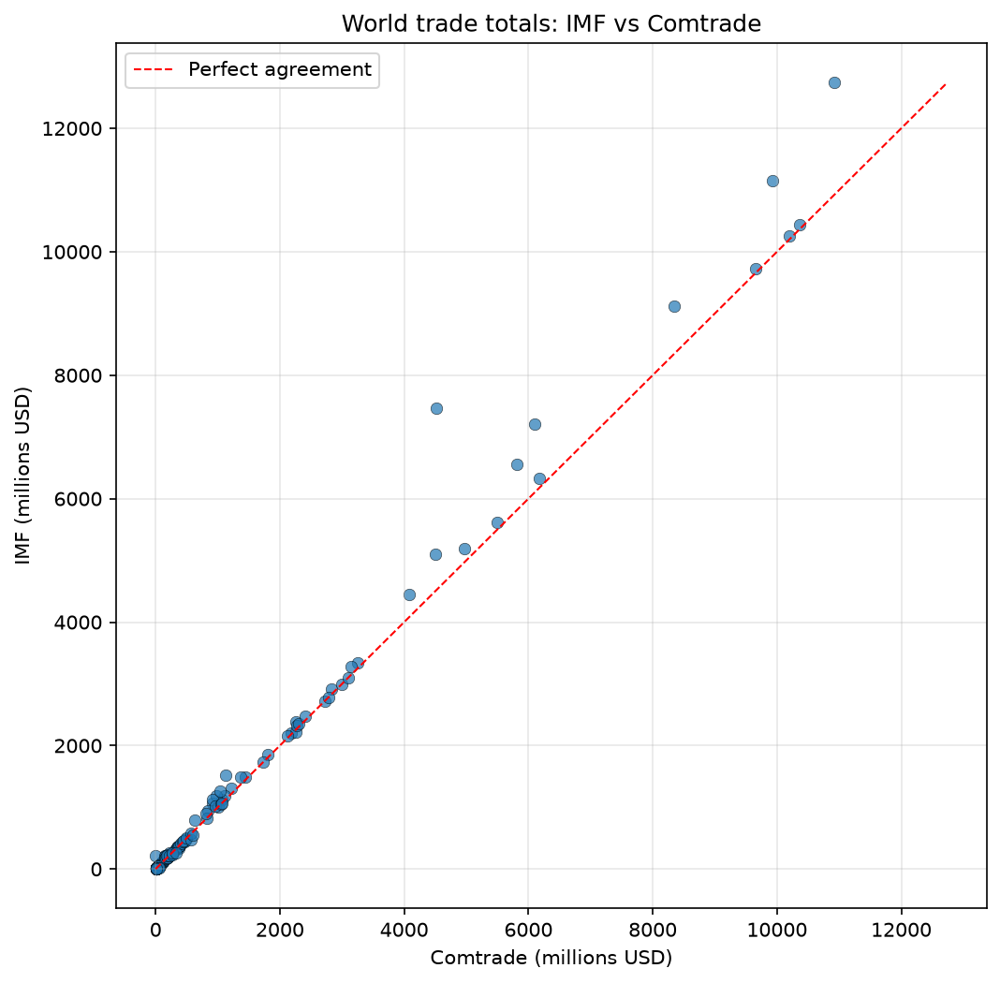
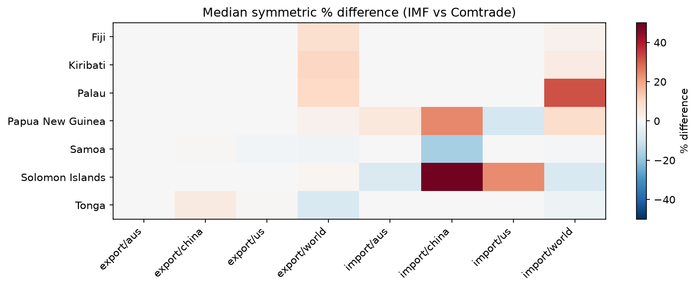
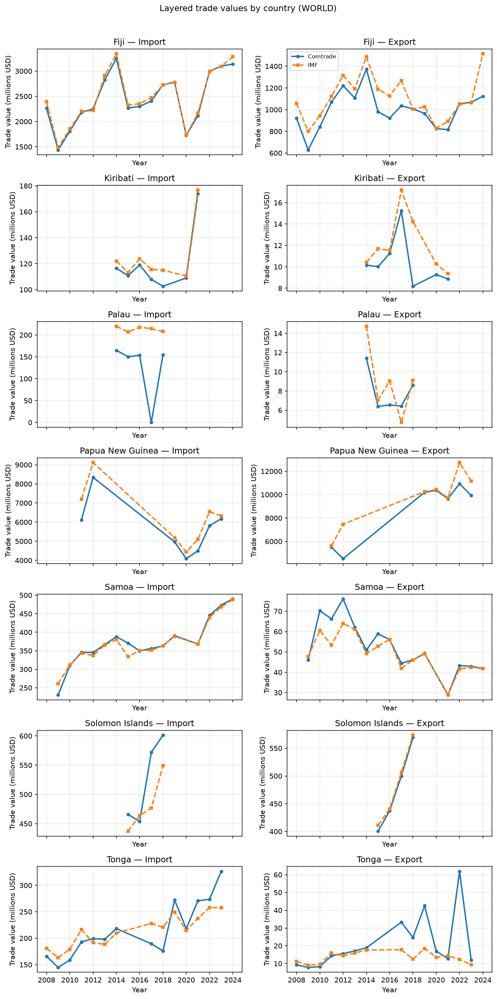
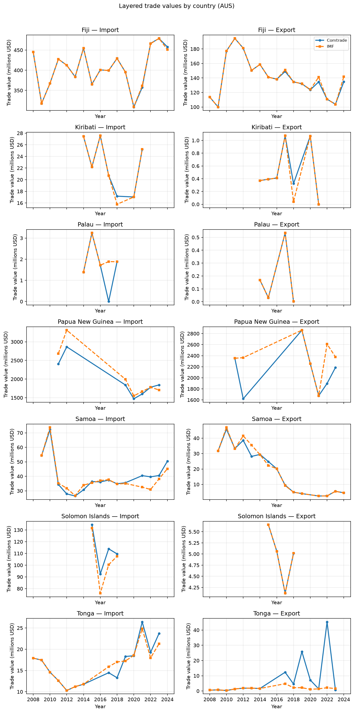
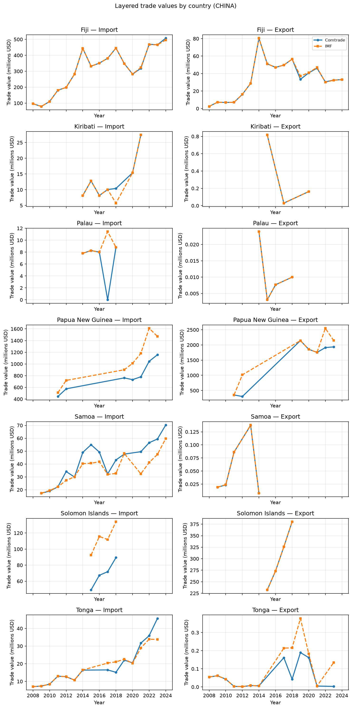
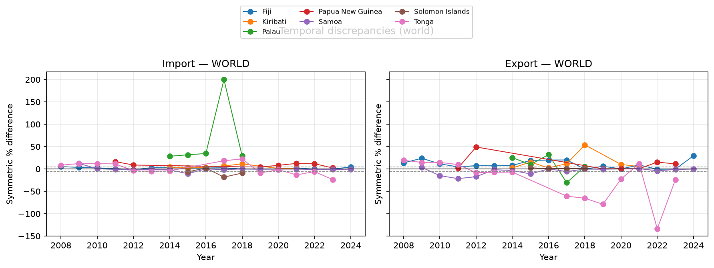
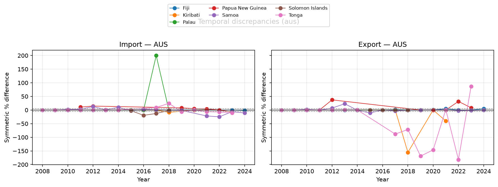
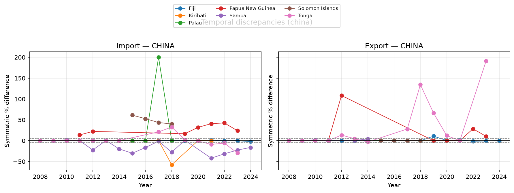
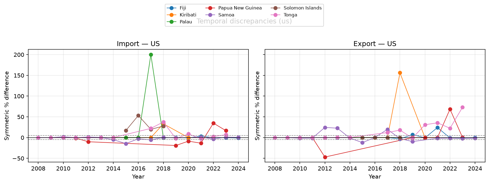

# UN Comtrade vs IMF Trade Data Discrepancy Analysis

## 1. Objectives and research hypothesis

### 1.1 Objectives

Quantify and visualize discrepancies between two international trade data sources:

| Source          | Folder / file                                      | Time coverage                 |
| --------------- | -------------------------------------------------- | ----------------------------- |
| **UN Comtrade** | `data/NEW COMTRADE data/TradeData_sitc4_ag3_2000_2024.csv` | 2008–2024 (varies by country; 2000–2007 unpublished) |
| **IMF DOTS**    | `data/IMF data/IMF_Pacific_DOTS.csv`               | 2000–2024                     |

### 1.2 Hypothesis

> *Significant discrepancies (temporal and otherwise) exist between UN Comtrade and IMF data for comparable variables, which limits the reliability of these sources.*

The analysis tests this hypothesis across **6 dimensions**: metadata discrepancies, data coverage, discrepancy magnitude, temporal trends, trade partners, and trade flow direction.

---

## 2. Analytical framework

The analysis is organized in **6 layers**:

```
┌─────────────────────────────────────────────────────────────┐
│  Layer 0: Metadata discrepancies                            │
│  → definitions, schema, coverage, partner availability      │
├─────────────────────────────────────────────────────────────┤
│  Layer 1: Coverage & comparability                          │
├─────────────────────────────────────────────────────────────┤
│  Layer 2: Data harmonization                                │
├─────────────────────────────────────────────────────────────┤
│  Layer 3: Discrepancy magnitude                             │
├─────────────────────────────────────────────────────────────┤
│  Layer 4: Temporal discrepancies                            │
├─────────────────────────────────────────────────────────────┤
│  Layer 5: Structural decomposition                          │
│  → country × flow × partner                                 │
└─────────────────────────────────────────────────────────────┘
```

### 2.1 Analysis dimensions

| Dimension   | Description                | Comparison keys              |
| ----------- | -------------------------- | ---------------------------- |
| **Metadata**| Definitions / schema / coverage flags | attributes, partners, extracts |
| **Time**    | Reporting year             | `year` / `time_period`       |
| **Country** | Reporting economy          | 7 Pacific countries          |
| **Flow**    | Export or import           | `export` / `import`          |
| **Partner** | Trade partner              | `world`, `aus`, `china`, `us`|
| **Value**   | Trade value (millions USD) | CIF (imports), FOB (exports) |

### 2.2 Comparison priority

1. **World totals** — most direct aggregate comparison between sources
2. **Bilateral Australia / China** — when Comtrade has matching partner data
3. **Bilateral USA** — comparable wherever the NEW COMTRADE extracts include `USA` partner rows (available across 2008–2024 for reporting countries)

---

## 3. Input data

### 3.1 UN Comtrade

- **Extract:** `data/NEW COMTRADE data/TradeData_sitc4_ag3_2000_2024.csv` (Premium API, SITC Rev.4 AG3)
- **Granularity:** commodity code × bilateral partner × flow × year
- **Partners:** `AUS`, `CHN`, `USA`, `W00`
- **Value fields:** normalized to `cifvalue__US__` / `fobvalue__US__` / `primaryValue__US__` (the API file uses unsuffixed names)
- **Loader notes:** the file may be latin-1 encoded and have trailing commas; the loader normalizes schema. Older period CSVs in the same folder are not used.
- **Reporters with rows:** Cook Islands, Fiji, Kiribati, Palau, Papua New Guinea, Samoa, Solomon Islands, Tonga (Cook Islands is not in the IMF extract)

**Data availability** (commodity-level records in the NEW COMTRADE extracts):

| Year | No of records | No of countries with data | Countries with available data |
| ---- | ------------- | ------------------------- | ----------------------------- |
| 2008 | 2,341 | 3 | Cook Islands, Fiji, Tonga |
| 2009 | 3,204 | 3 | Fiji, Samoa, Tonga |
| 2010 | 3,317 | 3 | Fiji, Samoa, Tonga |
| 2011 | 4,735 | 4 | Fiji, Papua New Guinea, Samoa, Tonga |
| 2012 | 4,933 | 4 | Fiji, Papua New Guinea, Samoa, Tonga |
| 2013 | 3,643 | 3 | Fiji, Samoa, Tonga |
| 2014 | 5,490 | 5 | Fiji, Kiribati, Palau, Samoa, Tonga |
| 2015 | 5,302 | 5 | Fiji, Kiribati, Palau, Samoa, Solomon Islands |
| 2016 | 5,397 | 5 | Fiji, Kiribati, Palau, Samoa, Solomon Islands |
| 2017 | 6,433 | 6 | Fiji, Kiribati, Palau, Samoa, Solomon Islands, Tonga |
| 2018 | 6,265 | 6 | Fiji, Kiribati, Palau, Samoa, Solomon Islands, Tonga |
| 2019 | 5,186 | 4 | Fiji, Papua New Guinea, Samoa, Tonga |
| 2020 | 4,659 | 4 | Fiji, Kiribati, Papua New Guinea, Tonga |
| 2021 | 5,706 | 5 | Fiji, Kiribati, Papua New Guinea, Samoa, Tonga |
| 2022 | 5,005 | 4 | Fiji, Papua New Guinea, Samoa, Tonga |
| 2023 | 5,037 | 4 | Fiji, Papua New Guinea, Samoa, Tonga |
| 2024 | 2,547 | 2 | Fiji, Samoa |

Total: **79,200** commodity-level records. Full table: `comtrade_availability_by_year.csv`.

### 3.2 IMF Pacific DOTS

- **Granularity:** Country × year × partner (Australia, China, USA, World)  
- **Units:** Millions USD  
- **12 Pacific countries** in the IMF file; only **7** have matching Comtrade data

### 3.3 Country name mapping

| Comtrade (`reporterDesc`)          | IMF (`country`)    |
| ---------------------------------- | ------------------ |
| Fiji                               | Fiji, Republic of  |
| Kiribati                           | Kiribati           |
| Palau                              | Palau, Republic of |
| Papua New Guinea                   | Papua New Guinea   |
| Samoa                              | Samoa              |
| Solomon Isds → **Solomon Islands** | Solomon Islands    |
| Tonga                              | Tonga              |

> **Note:** Comtrade records `Solomon Isds`; source code normalizes to `Solomon Islands` before merging. Cook Islands appears in 2008 Comtrade rows but has no IMF counterpart in this extract.

---

## 4. Metadata discrepancies analysis

This layer documents **definitional and structural mismatches** before interpreting value discrepancies. Implemented in `trade_discrepancy/metadata.py`.

### 4.1 Source-pair metadata attributes

| Attribute | Comtrade | IMF | Flag |
| --------- | -------- | --- | ---- |
| Concept | UN Comtrade merchandise trade | IMF DOTS | conceptual source difference |
| Frequency | Annual (`A`) | Annual file | aligned |
| Classification | Commodity-level (`S4`), then aggregated | Partner aggregates only | commodity-detail asymmetry |
| Valuation | CIF imports / FOB exports (+ primary fallback) | DOTS totals (not itemized in extract) | valuation documentation gap |
| Units | USD → MUSD in harmonization | Millions USD | aligned |
| Extracts | `sitc4_ag3_2000_2024` | single Pacific DOTS file | aligned |
| Partners | AUS / CHN / USA / W00 | aus / china / us / world | USA comparable where reporters have rows |

### 4.2 Country-level metadata coverage

| Country | Comtrade years | Missing years in span | Overlap with IMF | USA in Comtrade | Notes |
| ------- | -------------- | --------------------- | ---------------- | --------------- | ----- |
| Fiji | 17 (2008–2024) | — | 17 | Yes | continuous span |
| Samoa | 15 (2009–2024) | 2020 | 15 | Yes | gap in 2020 |
| Tonga | 14 (2008–2023) | 2015–2016 | 14 | Yes | two-year hole |
| Papua New Guinea | 7 (2011–2023) | 2013–2018 | 7 | Yes | six-year publishing gap |
| Kiribati | 7 (2014–2021) | 2019 | 7 | Yes | one-year hole |
| Palau | 5 (2014–2018) | — | 5 | Yes | short continuous span |
| Solomon Islands | 4 (2015–2018) | — | 4 | Yes | short overlap |

Full table: `metadata_coverage_by_country.csv`.

### 4.3 Metadata tables (from dataset fields)

Simple metadata comparisons are tables, not charts.

**Source concepts and schema** (`metadata_attribute_comparison.csv`, `schema_comparison.csv`): Comtrade is commodity-level customs/merchandise trade (`S4`, annual); IMF DOTS is partner aggregates with no commodity dimension. After normalization, all expected comparison keys are present in both sources.

**Valuation field availability** (`valuation_completeness.csv`):

| Flow | Field | Records | Present | Missing share |
| ---- | ----- | ------- | ------- | ------------- |
| Import | CIF | 57,038 | 53,957 | 5.4% |
| Import | FOB | 57,038 | 15,961 | 72.0% |
| Import | primary | 57,038 | 57,038 | 0% |
| Export | CIF | 22,145 | 5,423 | 75.5% |
| Export | FOB | 22,145 | 22,145 | 0% |
| Export | primary | 22,145 | 22,145 | 0% |

Harmonization uses imports CIF→primary and exports FOB→primary. The IMF extract has no CIF/FOB itemization.

**Commodity grain vs IMF aggregates** (`classification_grain.csv`):

| Country | Commodity-level rows | Distinct codes | Years | Partners |
| ------- | -------------------- | -------------- | ----- | -------- |
| Fiji | 24,832 | 260 | 17 | 4 |
| Samoa | 15,689 | 258 | 15 | 4 |
| Tonga | 14,538 | 259 | 14 | 4 |
| Papua New Guinea | 9,860 | 261 | 7 | 4 |
| Kiribati | 5,861 | 254 | 7 | 4 |
| Palau | 4,542 | 255 | 5 | 4 |
| Solomon Islands | 3,861 | 255 | 4 | 4 |

**Reporter coverage** (`reporter_coverage.csv`): 7 comparable PICs; 5 IMF-only (Marshall Islands, Micronesia, Nauru, Tuvalu, Vanuatu); Cook Islands is in Comtrade only.

### 4.4 Why metadata discrepancies matter

- Value alerts are only interpretable where metadata overlap exists (same partner, year, and valuation basis).
- The Premium API extract is a single SITC Rev.4 series. Observed years are 2008–2024; 2000–2007 were requested but unpublished.
- Remaining gaps are **missing reporter–years** (not every PIC reports every year), including holes inside a country's span (PNG 2013–2018, Tonga 2015–2016, Samoa 2020, Kiribati 2019).

Outputs:

- `metadata_attribute_comparison.csv`
- `metadata_coverage_by_country.csv`
- `metadata_discrepancy_flags.csv`
- `comtrade_availability_by_year.csv`
- `valuation_completeness.csv`
- `schema_comparison.csv`
- `classification_grain.csv`
- `reporter_coverage.csv`

---

## 5. Data harmonization procedure

### 5.1 Comtrade value extraction

For each commodity-level record:

- **Imports** (`flowCode = M`): use CIF; if missing, use `primaryValue`
- **Exports** (`flowCode = X`): use FOB; if missing, use `primaryValue`

### 5.2 Comtrade aggregation

- **World totals:** filter `partnerISO = 'W00'`, sum all commodity codes by `(country, year, flow)`  
  - Do *not* sum bilateral partners (AUS + CHN + USA) to approximate world — the extract covers only a subset of partners
- **Bilateral:** filter `partnerISO ∈ {AUS, CHN, USA}`, sum by the same keys  
- **Unit conversion:** divide by 1,000,000 to obtain millions USD

### 5.3 IMF long-format conversion

Each IMF row (country × year) is reshaped into up to 8 observations:

`(export, world)`, `(import, world)`, `(export, aus)`, `(import, aus)`, `(export, china)`, `(import, china)`, `(export, us)`, `(import, us)`

Blank cells are treated as missing (not imputed as zero).

### 5.4 Source merge (inner join)

Merged on:

```
(country, year, flow, partner)
```

Only observations **present in both sources** are retained → **535 comparable observations**.

---

## 6. Implemented formulas

Implemented in `trade_discrepancy/metrics.py` and `trade_discrepancy/harmonize.py`.

### 6.1 Comtrade trade value (USD)

$$
V_{i,t,f,p}^{\text{Comtrade}} =
\begin{cases}
\text{CIF}_{i,t,f,p} & \text{if } f = \text{import} \text{ and CIF is available} \\
\text{FOB}_{i,t,f,p} & \text{if } f = \text{export} \text{ and FOB is available} \\
\text{primaryValue}_{i,t,f,p} & \text{otherwise}
\end{cases}
$$

Where: $i$ = country, $t$ = year, $f$ = flow, $p$ = partner.

Aggregation:

$$
V_{i,t,f,p}^{\text{Comtrade, agg}} = \sum_{h \in \text{codes}} V_{i,t,f,p,h}
$$

Conversion to millions USD:

$$
V_{i,t,f,p}^{\text{Comtrade (MUSD)}} = \frac{V_{i,t,f,p}^{\text{Comtrade, agg}}}{10^6}
$$

### 6.2 Absolute difference

$$
\Delta_{i,t,f,p} = V_{i,t,f,p}^{\text{IMF}} - V_{i,t,f,p}^{\text{Comtrade}}
$$

Units: millions USD. A positive value means IMF exceeds Comtrade.

### 6.3 sMAPE - Symmetric Mean Absolute Percentage Error

$$
\text{SymDiff\%}_{i,t,f,p} =
\begin{cases}
\dfrac{\Delta_{i,t,f,p}}{\dfrac{\left|V_{i,t,f,p}^{\text{IMF}}\right| + \left|V_{i,t,f,p}^{\text{Comtrade}}\right|}{2}} \times 100\% & \text{if denominator} > 0 \\[6pt]
\text{NA} & \text{if both are zero}
\end{cases}
$$

**Advantage:** Symmetric around zero; more stable than ordinary percentage error for small Pacific trade flows.

**Tolerance threshold:** $|\text{SymDiff\%}| \leq 5\%$ (`DISCREPANCY_TOLERANCE_PCT = 5.0`).

### 6.4 Log ratio

$$
\text{LogRatio}_{i,t,f,p} = \ln\!\left(\frac{V_{i,t,f,p}^{\text{IMF}}}{V_{i,t,f,p}^{\text{Comtrade}}}\right)
$$

Computed only when both values are positive.

### 6.5 Summary statistics

By group $(i, f, p)$:

| Metric | Formula |
| ------ | ------- |
| Observations | $N_{i,f,p}$ |
| Mean absolute difference | $\overline{\|\Delta\|}_{i,f,p}$ |
| Median SymDiff% | $\text{median}(\text{SymDiff\%})$ |
| Mean SymDiff% | $\overline{\text{SymDiff\%}}_{i,f,p}$ |
| Max \|SymDiff%\| | $\max(\|\text{SymDiff\%}\|)$ |
| Share within 5% | $\dfrac{\#\{\|\text{SymDiff\%}\| \leq 5\%\}}{N_{i,f,p}}$ |

By year $(t, f, p)$: same metrics grouped by year instead of country.

---

## 7. Analysis results

### 7.1 Data coverage

Year-by-year Comtrade record counts are in section 3.1. Overlap with IMF for the seven mapped countries:

| Country | Comtrade years with rows | IMF | Overlap years | Comparison span | Missing years in span |
| ------- | ------------------------ | --- | ------------- | --------------- | --------------------- |
| Fiji | 17 (2008–2024) | 2000–2024 | **17** | 2008–2024 | — |
| Samoa | 15 (2009–2024) | 2000–2024 | **15** | 2009–2024 | 2020 |
| Tonga | 14 (2008–2023) | 2000–2024 | **14** | 2008–2023 | 2015–2016 |
| Papua New Guinea | 7 (2011–2012, 2019–2023) | 2000–2024 | **7** | 2011–2023 | 2013–2018 |
| Kiribati | 7 (2014–2018, 2020–2021) | 2000–2024 | **7** | 2014–2021 | 2019 |
| Palau | 5 (2014–2018) | 2000–2024 | **5** | 2014–2018 | — |
| Solomon Islands | 4 (2015–2018) | 2000–2024 | **4** | 2015–2018 | — |

**Notes:**

- IMF covers 25 years (2000–2024); Comtrade spans 2008–2024 where reporters published
- USA bilateral rows are present for every mapped country–year that appears in this extract
- 5 IMF countries (Vanuatu, Tuvalu, Marshall Islands, Micronesia, Nauru) have **no** Comtrade data in this extract; Cook Islands has Comtrade for 2008 only and no IMF row

### 7.2 Headline metrics

| Metric                        | Value      |
| ----------------------------- | ---------- |
| Total comparable observations | **535**    |
| World-total observations      | **138**    |
| Median SymDiff% (world)       | **+2.06%** |
| Mean \|SymDiff%\| (world)     | **12.42%** |
| Share of world within ±5%     | **47.1%**  |

| Partner         | Observations | Median SymDiff% | Share within ±5% |
| --------------- | ------------ | --------------- | ---------------- |
| World           | 138          | +2.06%          | 47%              |
| Australia (aus) | 137          | ~0%             | 74%              |
| China (china)   | 122          | ~0%             | 70%              |
| USA (us)        | 138          | ~0%             | 75%              |



*Points on the red dashed line indicate perfect agreement. Palau (2017 world import at zero in Comtrade) and later Tonga world exports pull away from the 45° line.*

### 7.3 Results by country, flow, and partner

#### Countries with strong agreement

| Country              | Flow              | Partner           | Median SymDiff% | Share ±5% |
| -------------------- | ----------------- | ----------------- | --------------- | --------- |
| **Fiji**             | Import            | Australia         | ~0%             | 100%      |
| **Fiji**             | Import            | China             | ~0%             | 100%      |
| **Fiji**             | Import            | USA               | ~0%             | 100%      |
| **Fiji**             | Export            | Australia         | ~0%             | 100%      |
| **Palau**            | Export            | AUS / CHN / USA   | ~0%             | 100%      |
| **Solomon Islands**  | Export            | AUS / CHN / USA / World | < 2%      | 100%      |

> **Typical example:** Fiji imports from Australia in 2013 — Comtrade and IMF match to well within 0.01% (near-zero error).

The Fiji overlay in `layered_values_overview_aus.png` and `layered_values_overview_world.png` shows this close tracking.

#### Countries with large, systematic gaps

| Country             | Flow   | Partner | Median SymDiff%  | Share ±5% | Comment                                             |
| ------------------- | ------ | ------- | ---------------- | --------- | --------------------------------------------------- |
| **Palau**           | Import | World   | **+31.7%**       | 0%        | 2017 Comtrade world import is 0 while IMF is 214 MUSD |
| **Palau**           | Import | AUS/CHN/US | max **+200%** | 80%       | Same 2017 zero-import year inflates the max         |
| **Tonga**           | Export | World   | **−7.8%**        | 0%        | Large later-year gaps (2017–2022)                   |
| **PNG**             | Import | China   | **+23.9%**       | 0%        | 7 observation years                                 |
| **Solomon Islands** | Import | China   | **+48.2%**       | 0%        | Structural gap at China partner                     |
| **Samoa**           | Import | China   | **−16.5%**       | 40%       | Moderate gap                                        |



*Red = IMF above Comtrade; blue = IMF below Comtrade. Palau world imports and Solomon Islands China imports stand out; Kiribati no longer shows the ~2× gap seen in the retired legacy panels.*



*Comtrade (solid) vs IMF (dashed) world totals over overlapping years — Fiji tracks closely; Palau 2017 and later Tonga exports diverge.*





*Bilateral Australia/China overlays track more closely than world totals for most countries.*

### 7.4 Ten largest discrepancies (world totals)

| Country  | Year | Flow   | Comtrade (MUSD) | IMF (MUSD) | SymDiff%   |
| -------- | ---- | ------ | --------------- | ---------- | ---------- |
| Palau    | 2017 | Import | 0.00            | 214.18     | **+200%**  |
| Tonga    | 2022 | Export | 61.86           | 12.32      | **−133.6%** |
| Tonga    | 2019 | Export | 42.47           | 18.46      | **−78.8%** |
| Tonga    | 2018 | Export | 24.63           | 12.50      | **−65.3%** |
| Tonga    | 2017 | Export | 33.28           | 17.78      | **−60.7%** |
| Kiribati | 2018 | Export | 8.19            | 14.23      | **+53.9%** |
| Papua New Guinea | 2012 | Export | 4,517.69    | 7,469.42   | **+49.2%** |
| Palau    | 2016 | Import | 153.51          | 217.93     | **+34.7%** |
| Palau    | 2016 | Export | 6.54            | 9.05       | **+32.2%** |
| Palau    | 2015 | Import | 150.32          | 206.99     | **+31.7%** |

**Palau 2017 import:** Comtrade world import is missing/zero while IMF reports 214 MUSD — a coverage hole, not a small valuation difference.

**Tonga later exports:** 2017–2022 world exports sit well above IMF. These series are in `layered_values_overview_world.png`.

### 7.5 Temporal trends (world totals)

| Year | Median SymDiff% (approx.) | Notes |
| ---- | ------------------------- | ----- |
| 2008–2012 | World totals often outside ±5% | Few reporters (Fiji, Tonga, Samoa, PNG) |
| 2013–2016 | Mixed; Palau world imports already wide | Kiribati world imports now much closer than in legacy panels |
| 2017–2018 | Palau 2017 zero-import year; Tonga export gaps begin | Six reporters at peak coverage |
| 2019–2023 | Tonga/PNG gaps persist; Fiji still close | PNG returns after a 2013–2018 publishing gap |
| 2024 | Only Fiji and Samoa | Interpret with caution |

Full year × flow × partner stats are in `summary_by_year.csv`.









*Gray dashed lines mark the ±5% tolerance band. Coverage follows reporter years in the Premium extract (2008–2024).*

---

## 8. Interpretation and hypothesis assessment

### 8.1 Main conclusions

The hypothesis is **partially supported, in a context-dependent way**:

1. **Metadata discrepancies constrain interpretation.** Reporter–year holes in the single Premium extract must be read before treating value gaps as anomalies.
2. **Discrepancies are not uniform.** Fiji–Australia/China/USA imports match closely. Palau 2017 world imports, later Tonga world exports, and Solomon Islands China imports do not.
3. **Bilateral series agree better than world totals.** Share within ±5%: USA 75%, Australia 74%, China 70%, world 47%.
4. **Reliability is country-specific.** Neither source can be declared universally more accurate; assessment must be done by country, flow, and partner.
5. **The legacy Kiribati ~2× gap does not reproduce** on these NEW COMTRADE extracts. Remaining Kiribati world-export disagreement is smaller (median +10%). Palau’s 2017 missing world import remains the largest single hole.

### 8.2 Assessment against the original hypothesis

| Hypothesis aspect | Assessment |
| ----------------------------- | ---------------------------------------------------------------------------------------- |
| **Significant discrepancies** | **Yes** — especially Palau (2017 imports), Tonga (later world exports), Solomon Islands (China imports) |
| **Temporal discrepancies** | **Yes** — varies by year; 2017–2022 Tonga and 2024 (two reporters only) differ from mid-sample years |
| **Metadata discrepancies** | **Yes** — schema/extract/partner coverage gaps are material |
| **Limits source reliability** | **Yes, but not universally** — Fiji bilateral imports remain reliable at aggregate level |
