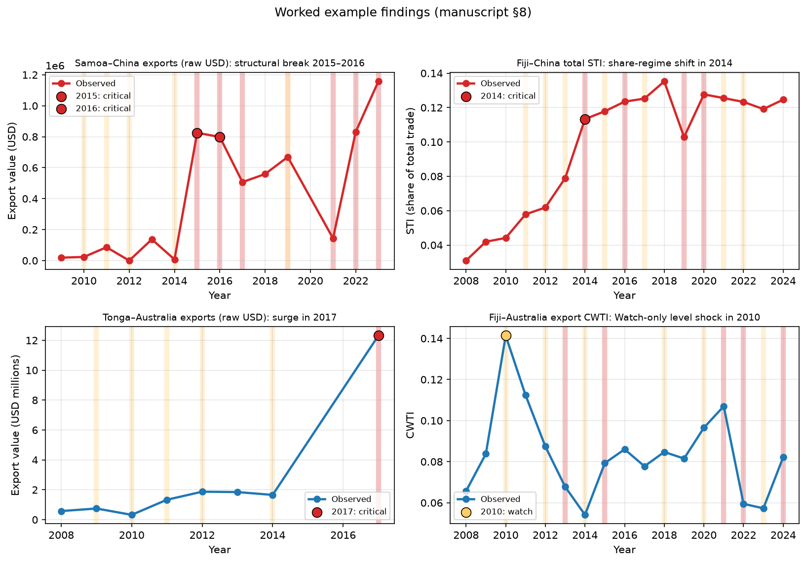
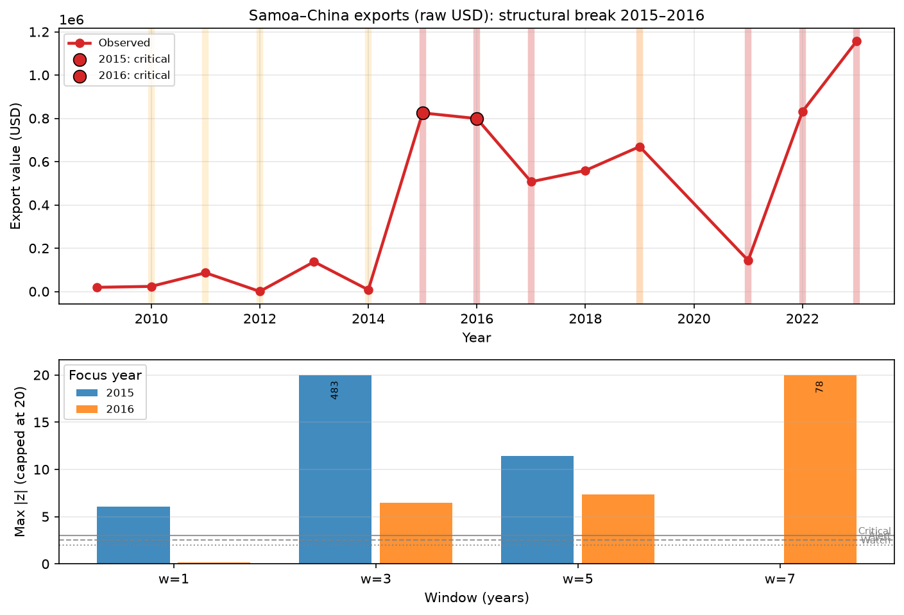
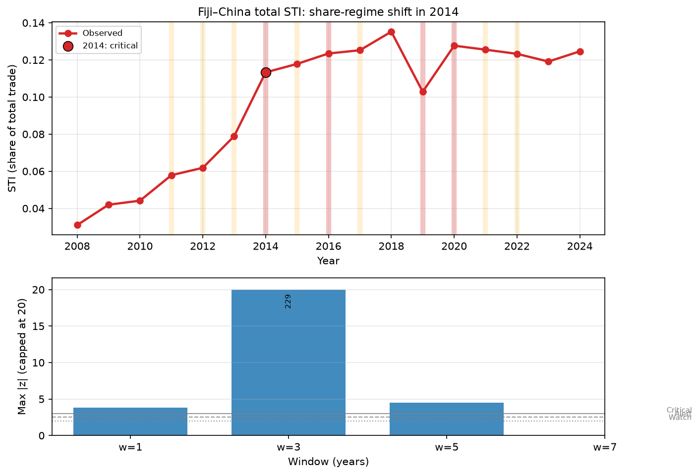
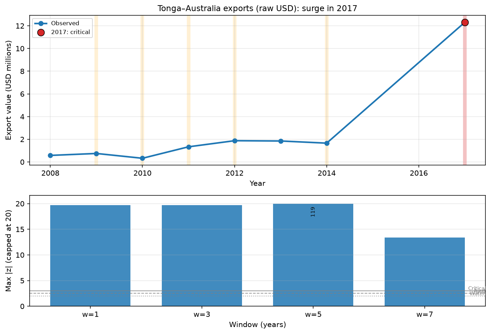
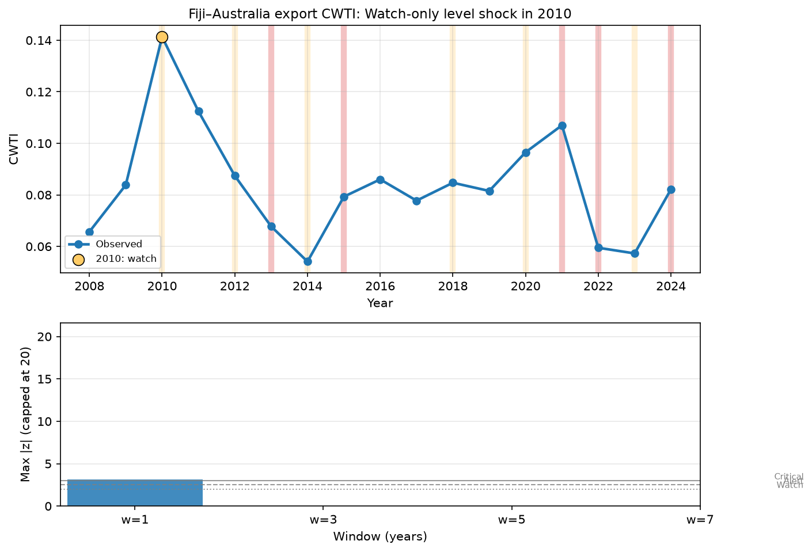

# Multi-Scale Anomaly Detection in Pacific Island Bilateral Trade: Manuscript Notes

**Working title (provisional):** *Detecting Abnormal Trends in Pacific Island–Major Power Trade: A Multi-Scale Sliding-Window Framework Using UN Comtrade*

**Research question:** Can we identify “abnormal trends” in bilateral trade data that warrant operational attention?

**Status of this document:** Ready-for-manuscript methods-and-findings notes (not yet a full journal article). Language, notation, and example interpretations are drafted for direct reuse in a methods section, results section, and discussion.

**Empirical scope (current implementation):** UN Comtrade only; Pacific Island reporters; partners Australia, China, and the United States; annual frequency (2008–2024, coverage varies by country); metrics = raw bilateral values, Simple Trade Index (STI), and Commodity-Weighted Trade Index (CWTI).

**Reproduction:** `python scripts/run_trade_anomaly_analysis.py` → `outputs/trade_anomaly/`.

---

## 1. Motivation and conceptual framing

Bilateral trade series for small open economies frequently exhibit abrupt level changes (commodity windfalls, one-off contracts, disaster-related imports) and slower regime shifts (partner reorientation, sustained export-platform growth). For research and monitoring purposes, both classes of irregularity are of interest, but they are not observationally equivalent:

| Anomaly class | Informal definition | Temporal signature |
| ------------- | ------------------- | ------------------ |
| **Level shock** | Acute departure from the immediate local baseline | Large short-scale residual; longer scales often remain quiet or revert quickly |
| **Structural break** | Change in the underlying level and/or trend of the data-generating process | Elevated residuals (or forecast bias) that persist across medium/long scales and/or across consecutive years |

A single fixed moving window is poorly suited to both tasks simultaneously. Short windows react quickly but misclassify cyclical or trending variation as shocks; long windows stabilise the baseline but dilute acute events. The framework therefore adopts a **multi-scale sliding-window** design: concurrent windows $\mathcal{W}=\{1,3,5,7\}$ years, one-step-ahead local forecasts, robust residual standardisation, and a **severity fusion rule** that maps cross-scale evidence into operational attention tiers (Watch / Alert / Critical).

**Methodological caveat (stated up front).** Sliding-window one-step forecasting is strongest for *acute* anomalies. Gradual drift remains only partially addressed via longer windows and a persistence upgrade; dedicated break tests (e.g., Bai–Perron, CUSUM on Holt levels) are natural extensions, not substitutes claimed by the present residual pipeline.

---

## 2. Data and series construction

### 2.1 Source and unit of observation

Let $i$ index Pacific Island reporters, $j\in\{\mathrm{AUS},\mathrm{CHN},\mathrm{USA}\}$ bilateral partners, $f\in\{\mathrm{import},\mathrm{export}\}$ flows, and $t$ calendar year. Raw Comtrade records are aggregated to an HS2 commodity panel and then to partner–flow totals using standard CIF (imports) / FOB (exports) valuation with primary-value fallback.

The empirical panel underlying the first full run comprises:

- **8 reporters:** Cook Islands, Fiji, Kiribati, Palau, Papua New Guinea, Samoa, Solomon Islands, Tonga  
- **Years:** 2008–2024 (unbalanced)  
- **183 unique series** and **1,340 series–year observations** after constructing the metric set below  

### 2.2 Metrics under surveillance

Three families of series are monitored.

**(A) Raw bilateral trade value**

$$
V_{i,j,f,t}\in\mathbb{R}_{+}
$$

(USD; modelled on the observed scale).

**(B) Simple Trade Index (STI)**

Combined (total-trade) STI follows the influence-index definition:

$$
\mathrm{STI}_{i,j,t}
=
\frac{V_{i,j,\mathrm{imp},t}+V_{i,j,\mathrm{exp},t}}
{V_{i,\mathrm{W},\mathrm{imp},t}+V_{i,\mathrm{W},\mathrm{exp},t}},
$$

where $\mathrm{W}$ denotes the World partner. Flow-specific STI isolates directional dependence:

$$
\mathrm{STI}^{f}_{i,j,t}
=
\frac{V_{i,j,f,t}}{V_{i,\mathrm{W},f,t}},
\quad
V_{i,\mathrm{W},f,t}>0.
$$

**(C) Commodity-Weighted Trade Index (CWTI)**

For each flow $f$, HS2 commodity $c$,

$$
s^{f}_{i,j,c,t}
=
\frac{V_{i,j,f,c,t}}{V_{i,\mathrm{W},f,c,t}},
\qquad
w^{f}_{i,c,t}
=
\frac{V_{i,\mathrm{W},f,c,t}}{\sum_{c'}V_{i,\mathrm{W},f,c',t}},
$$

and

$$
\mathrm{CWTI}^{f}_{i,j,t}
=
\sum_{c}\left(s^{f}_{i,j,c,t}\right)^{2}w^{f}_{i,c,t}.
$$

Combined CWTI sums import and export terms. CWTI emphasises concentration in commercially important chapters; therefore anomalies in CWTI can signal reallocation of partner intensity even when aggregate STI moves modestly.

Each series is identified by the tuple $(i,j,f,m)$ with metric $m\in\{\mathrm{raw},\,\mathrm{STI},\,\mathrm{CWTI}\}$ and flow $f\in\{\mathrm{import},\,\mathrm{export},\,\mathrm{total}\}$ (the last for combined indices only).

---

## 3. Window design: three complementary strategies

### 3.1 Domain knowledge and macroeconomic cycles

Annual trade embeds trend, cyclical, and irregular components. A monitoring window should preferably cover a non-trivial fraction of a business/political cycle so that local models are not fitted exclusively inside a boom or bust:

| Reference | Approximate length | Implication for annual windows |
| --------- | ------------------ | ------------------------------ |
| Kitchin inventory cycle | $\approx 40$ months ($\approx 3$ years) | Short–medium structural scale |
| NBER average full cycle | $\approx 5$ years | Medium baseline |
| Electoral/political cycles | $4$–$5$ years | Medium baseline |

**Design conclusion:** the medium/long arm of the window bank is anchored at **3–5–7 years**, with **7 years** providing additional slow-context capacity on the longer Pacific Comtrade extracts.

### 3.2 Autocorrelation diagnostics

For a series $\{y_t\}_{t=1}^{T}$, the sample autocorrelation at lag $k$ is

$$
r_{k}
=
\frac{\sum_{t=k+1}^{T}(y_t-\bar y)(y_{t-k}-\bar y)}
{\sum_{t=1}^{T}(y_t-\bar y)^{2}}.
$$

Two uses are retained:

1. **Cyclicality.** Significant peaks at lag $k^{\star}$ argue that the shortest *structural* window should be at least $k^{\star}$ so that regular oscillation is absorbed into the local baseline rather than labelled as a shock.  
2. **Memory.** Rapid decay of $r_k$ supports smaller windows; slow decay supports wider windows.

In the present annual panel, series are short (median length $\approx 5$ observed years among ACF-eligible series). Empirically, suggested minimum windows based on a $1.96/\sqrt{T}$ bound concentrate near **1**, with occasional peaks up to lag 6–7. ACF is therefore treated as a **diagnostic accompaniment**, not as an automatic single-window optimiser—reinforcing the need for an explicit multi-scale bank.

### 3.3 Multi-scale implementation (primary design)

Rather than committing to one $w$, define

$$
\mathcal{W}=\{1,3,5,7\},
\qquad
\text{stride }=1\text{ year}.
$$

Interpretation of scales:

| $w$ | Role |
| ----- | ---- |
| 1 | Ultra-short / acute reaction (naïve last-value baseline) |
| 3 | Short structural (Kitchin-scale) |
| 5 | Medium structural (NBER / political-cycle scale) |
| 7 | Long structural (slow baseline) |

**Fusion principle:** ultra-short evidence can raise attention, but **Critical** severity requires medium/long (structural) corroboration. This directly addresses alert fatigue from noisy annual jumps while preserving sensitivity to true spikes.

---

## 4. Local predictive models

For each series and each $w\in\mathcal{W}$, at target year $t$ let the estimation sample be the $w$ immediately preceding observed values

$$
\mathcal{H}_{t,w}=\{y_{t-w},\ldots,y_{t-1}\}
$$

(in observation order; calendar gaps are not interpolated). A one-step forecast $\hat y_{t\mid t-1}^{(w,m)}$ is produced by model $m$.

### 4.1 Naïve forecast ($w=1$)

$$
\hat y_{t}^{(1,\mathrm{naïve})}=y_{t-1}.
$$

Holt and AR(1) are unidentified or unstable on a singleton history; hence $w=1$ uses only the naïve predictor. Residual scale for the first scored points uses a short trailing buffer of local deviations (lookback of three prior observations when available).

### 4.2 Holt’s linear (additive) method

With level $\ell_\tau$ and trend $b_\tau$,

$$
\begin{align}
\ell_\tau
&=
\alpha y_\tau+(1-\alpha)(\ell_{\tau-1}+b_{\tau-1}),\\
b_\tau
&=
\beta(\ell_\tau-\ell_{\tau-1})+(1-\beta)b_{\tau-1},\\
\hat y_{\tau+1}
&=
\ell_\tau+b_\tau.
\end{align}
$$

Parameters $(\alpha,\beta)$ are selected on a coarse grid by minimising in-sample one-step SSE within $\mathcal{H}_{t,w}$. Holt is the **primary** model for detecting level/trend breaks because the latent trend component absorbs gradual change inside the window and exposes post-break forecast bias outside it.

### 4.3 AR(1) with intercept

$$
y_\tau = c + \phi y_{\tau-1}+\varepsilon_\tau,
\qquad
\hat y_{t}= \hat c + \hat\phi y_{t-1},
$$

estimated by OLS on $\mathcal{H}_{t,w}$ when $w\ge 4$; otherwise the procedure falls back to naïve. AR(1) is complementary for mean-reverting share series (STI/CWTI).

For $w\ge 3$, both Holt and AR(1) are evaluated; the scale-specific anomaly intensity uses the **maximum absolute robust $z$** across models (conservative union for attention).

---

## 5. Residual scoring

### 5.1 Forecast error

$$
e_{t}^{(w,m)}=y_t-\hat y_{t\mid t-1}^{(w,m)}.
$$

### 5.2 Robust scale

Let $\{e_{s}\}_{s<t}$ denote previously realised residuals for the same $(w,m)$ path (expanding history). Define the median absolute deviation (MAD) scale

$$
\hat\sigma_{t}
=
1.4826\cdot
\mathrm{median}_{s<t}\bigl(|e_s-\mathrm{median}_{u<t}(e_u)|\bigr),
$$

with fallbacks to sample standard deviation or mean absolute residual if MAD is numerically degenerate, and a unit floor to avoid division by zero.

### 5.3 Robust $z$-score

$$
z_{t}^{(w,m)}=\frac{e_{t}^{(w,m)}}{\hat\sigma_{t}},
\qquad
Z_{t}^{(w)}=\max_{m}\bigl|z_{t}^{(w,m)}\bigr|.
$$

Large $Z_{t}^{(w)}$ indicates that the realised observation is poorly explained by the local predictive model at scale $w$.

**Note on extreme magnitudes.** When early residual histories are nearly constant, $\hat\sigma_t$ can be very small and $Z$ can become numerically large. For scientific reporting, extreme $Z$ should be interpreted as **ordinal evidence of surprise** (rank/severity), not as calibrated Gaussian tail probabilities. Thresholds below are operational cut-offs on this robust score, not classical $p$-values.

---

## 6. Multi-scale fusion and operational attention tiers

### 6.1 Severity tiers

Define structural windows $\mathcal{W}_{\mathrm{S}}=\{3,5,7\}$ and thresholds $\tau_{\mathrm{W}}=2.0$, $\tau_{\mathrm{A}}=2.5$, $\tau_{\mathrm{C}}=3.0$.

| Tier | Decision rule | Operational meaning |
| ---- | ------------- | ------------------- |
| **None** | $\max_w Z_t^{(w)}<\tau_{\mathrm{W}}$ | Within local expectation |
| **Watch** | Some $w$ with $Z_t^{(w)}\ge\tau_{\mathrm{W}}$, but Alert/Critical rules fail | Attention / desk review |
| **Alert** | At least two scales in $\mathcal{W}_{\mathrm{S}}$ with $Z\ge\tau_{\mathrm{A}}$, **or** $Z^{(1)}\ge\tau_{\mathrm{A}}$ and at least one structural scale $\ge\tau_{\mathrm{A}}$ | Actionable anomaly |
| **Critical** | At least two scales in $\mathcal{W}_{\mathrm{S}}$ with $Z\ge\tau_{\mathrm{C}}$, **or** persistence upgrade (below) | Priority escalation |

**Hard constraint:** $w=1$ alone never yields Critical. Ultra-short spikes without structural corroboration remain at most Watch (or Alert only if paired with a structural scale at the Alert threshold).

### 6.2 Persistence upgrade

If a series remains structurally elevated ($Z^{(w)}\ge\tau_{\mathrm{A}}$ for some $w\in\mathcal{W}_{\mathrm{S}}$) for $K=2$ consecutive scored years **and** the current tier is already Alert, the tier is upgraded to Critical. This encodes the economic intuition that sustained forecast failure is more consistent with a regime shift than with a one-off spike.

### 6.3 Anomaly-type heuristics

Conditional on a non-null tier:

| Label | Heuristic |
| ----- | --------- |
| **Level shock** | Ultra-short hot; no structural window hot |
| **Structural break** | Medium/long ($5$ or $7$) involvement with structural elevation, or structural-only elevation |
| **Uncertain** | Ultra-short and structural jointly hot (mixed evidence) |

These labels are **hypothesis generators** for qualitative review, not supervised classifiers.

---

## 7. Headline empirical results (first full Comtrade run)

### 7.1 Aggregate attention map

Among **1,157** scored series–years (those with sufficient history for at least one window), **655 (56.6%)** received a non-null tier:

| Tier | Series–years | Distinct series | Countries |
| ---- | ------------: | --------------: | --------: |
| Watch | 474 | 156 | 7 |
| Alert | 48 | 40 | 7 |
| Critical | 133 | 54 | 5 |
| **Total flagged** | **655** | — | — |

The high Watch share is expected under an unsupervised, multi-metric screen on volatile small-economy trade. The scarcer Alert/Critical mass is the operationally relevant subset.

**Anomaly-type composition among flagged events:**

| Type | Count |
| ---- | ----: |
| Structural break | 463 |
| Level shock | 124 |
| Uncertain | 68 |

Level shocks appear **only** in the Watch tier (by construction of the fusion rules). Critical events are dominated by structural-break and uncertain labels—consistent with the design goal that Critical require multi-scale or persistent evidence.

### 7.2 Where Critical pressure concentrates

**By partner (Critical counts):** China 68, Australia 40, United States 25.  
**By reporter (Critical counts):** Fiji 62, Samoa 51, Tonga 13, Kiribati 6, Palau 1 (PNG and Solomon Islands register Watches/Alerts but no Critical in this run).  
**By calendar year:** Critical counts peak around **2015–2018** (19, 8, 22, 15 respectively), a period that overlaps major Pacific trade reconfigurations and post-commodity-cycle adjustment; counts decline toward 2023–2024 as fewer long windows are fully supported at the sample end for some series.

**By metric:** CWTI contributes the largest Critical count (73), followed by STI (32) and raw USD (28). This pattern is substantively informative: concentration-weighted indices can flag partner–commodity reallocation that aggregate values alone understate.

---

## 8. Worked example findings

The following cases illustrate how the multi-scale machinery translates into economically readable narratives. Values are taken from `outputs/trade_anomaly/csv/`. Corresponding figures are written to `outputs/trade_anomaly/plots/` when the pipeline is run:

| Section | Figure file |
| ------- | ------------ |
| Overview (all four cases) | `example_worked_findings_overview.png` |
| §8.1 Samoa–China exports | `example_samoa_china_export_raw.png` |
| §8.2 Fiji–China STI | `example_fiji_china_total_sti.png` |
| §8.3 Tonga–Australia exports | `example_tonga_aus_export_raw.png` |
| §8.4 Fiji–Australia export CWTI | `example_fiji_aus_export_cwti.png` |

Each individual figure has two panels: (top) the observed series with tier-coloured focus years; (bottom) multi-scale max $|z|$ at the focus year(s), with Watch/Alert/Critical thresholds and values above 20 labelled as capped.

### 8.1 Structural break with corroboration across scales: Samoa–China export values, 2015–2016

**Series:** `Samoa|china|export|raw_usd`.

Selected observations (USD):

| Year | Export value to China |
| ---- | --------------------: |
| 2012 | 170 |
| 2013 | 137,277 |
| 2014 | 7,675 |
| **2015** | **825,073** |
| **2016** | **798,996** |
| 2017 | 506,999 |
| … | … |

**2015 (Critical; structural break).**  
Relative to 2014, exports jump by roughly two orders of magnitude. Scale-wise robust scores (max over models) include approximately:

- $Z^{(1)}\approx 6.1$ (naïve residual $\approx 817{,}398$ on a MAD scale $\approx 1.34\times 10^{5}$)  
- $Z^{(3)}$ very large under Holt (history still dominated by the low 2012–2014 regime)  
- $Z^{(5)}\approx 11.4$  

Thus the event is not merely a one-year naïve surprise: medium-scale local trend models also fail. Fusion therefore assigns **Critical**, type **structural_break**.

**2016 (Critical; continued regime).**  
The level remains elevated ($\approx 799{,}000$). The ultra-short score collapses ($Z^{(1)}\approx 0.16$) because naïve now compares 2016 to the already-high 2015 value—exactly the behaviour expected after a level shift has entered the short memory. Structural windows remain hot ($Z^{(3)}\approx 6.5$, $Z^{(7)}$ large under AR(1)), so Critical status persists.  

**Interpretation for manuscript text.** This pair demonstrates the multi-scale logic: *onset* is visible at short and medium scales; *continuation* is invisible to $w=1$ but still flagged by $w\in\{3,5,7\}$. A single short window would have falsely “cleared” 2016; a single long window would have delayed onset detection. The bottom panel of the figure makes this contrast explicit: 2015 bars are elevated at $w=1$ and $w=3$; 2016 bars fall at $w=1$ while remaining elevated at longer scales.

### 8.2 Gradual partner-share rise then threshold breach: Fiji–China total STI, 2014

**Series:** `Fiji|china|total|sti`.

STI rises steadily from $\approx 0.031$ (2008) to $\approx 0.079$ (2013), then jumps to $\approx 0.113$ (2014) and thereafter plateaus in the $0.10$–$0.14$ band through the mid-2020s.

At **2014** the fusion outcome is **Critical / structural_break**, with approximately $Z^{(1)}\approx 3.8$, $Z^{(3)}$ extreme under Holt, and $Z^{(5)}\approx 4.5$. Economically, China’s share of Fiji’s total trade crossed from a single-digit regime into a persistent low-teens regime. The alert is therefore not a one-off import spike narrative but a **share-structure** narrative—precisely why STI (and CWTI) are monitored alongside raw values.

### 8.3 Acute export surge with multi-scale confirmation: Tonga–Australia exports, 2017

**Series:** `Tonga|aus|export|raw_usd`.

Exports hover between roughly $0.3$–$1.9$ million USD over 2008–2014, then the next available observation in 2017 is $\approx 12.3$ million USD. Scores are elevated at every available scale (ultra-short and structural $Z$ all $\gg 3$), producing **Critical / structural_break**.  

**Caveat for careful writing.** The calendar gap (2015–2016 missing in this series) means the “window” is defined in observation order, not as three unbroken calendar years. Manuscript text should state this explicitly: the detector flags *forecast failure relative to the recent observed history*, which remains a valid attention signal, but gap years can amplify apparent breaks and should be footnoted in country case studies. The figure’s broken time axis (no markers for 2015–2016) visualises that gap.

### 8.4 Clean level-shock Watch (ultra-short only): Fiji–Australia export CWTI, 2010

**Series:** `Fiji|aus|export|cwti`, year **2010**, tier **Watch**, type **level_shock**, $Z^{(1)}\approx 3.17$, structural windows unavailable or below threshold.

This is the canonical short-memory event under the fusion rules: large naïve surprise without medium/long corroboration. Operationally it warrants desk review (Watch) but not escalation—protecting the Critical tier from isolated noise. In the $|z|$ panel, only $w=1$ clears the Watch threshold.

### 8.5 Cross-metric triangulation (recommended reporting practice)

For any Critical country–partner–year, manuscript results should present the **metric bundle** jointly. Example pattern observed for Samoa–China around 2015–2016:

- Raw export value: Critical (level jump)  
- Export STI / CWTI: often Critical in neighbouring years  

Agreement across raw levels and concentration/share metrics strengthens the claim that the anomaly is not an artefact of a single index transformation. Disagreement (e.g., raw Watch only, indices quiet) suggests a scale effect that may be less consequential for dependence structure.

---

## 9. Discussion points for the paper

### 9.1 What the framework answers

The procedure operationalises the research question as: *relative to a bank of local predictive baselines spanning acute to slow memory, which series–years produce forecast residuals that jointly exceed severity thresholds?* The output is an **attention map**, not a causal claim about geopolitics or data error.

### 9.2 Why multi-scale is preferable to a single 3–5 year window

Domain theory justifies 3–5 years as a *structural* baseline, but:

1. Acute shocks are attenuated inside long windows.  
2. Annual PIC panels are short; a lone 5–7 year window yields few scored points early in the sample.  
3. Empirically, onset vs continuation (Samoa–China 2015 vs 2016) requires both short and long arms.

### 9.3 Limitations (must appear in manuscript)

1. **Annual frequency** coarsens timing; planned monthly Comtrade extracts should remap $\mathcal{W}$ to $\{12,36,60,84\}$ months with seasonal models as needed.  
2. **Unsupervised thresholds** lack labelled ROC calibration; sensitivity analyses over $\{\tau_{\mathrm{W}},\tau_{\mathrm{A}},\tau_{\mathrm{C}}\}$ should be reported as robustness.  
3. **Near-zero MAD** can inflate $Z$; report ranks/tiers primarily; optionally winsorise scales in a robustness appendix.  
4. **Reporting discontinuities** and missing years can mimic structural breaks (Tonga example).  
5. **Gradual drift** remains only partially covered; multi-scale + persistence mitigate but do not replace formal break tests.  
6. **No ground truth:** external validation should use documented events (commodity shocks, disaster years, known partner agreements) as narrative corroboration, not as training labels in v1.

### 9.4 Relation to companion studies in this project

- **Trade discrepancy (Comtrade vs IMF)** addresses measurement disagreement across sources.  
- **Trade influence (STI/CWTI)** summarises partner dependence.  
- **This anomaly module** asks when those (and raw) series *depart abnormally* from their own recent dynamics—an orthogonal but complementary layer for “what needs attention.”

---

## 10. Suggested manuscript outline (reuse of these notes)

1. **Introduction** — RQ; level shock vs structural break; need for attention flags in PIC–major power trade.  
2. **Related literature** — trade data irregularity; structural break methods; multi-scale / multi-resolution anomaly detection; Pacific trade dependence.  
3. **Data** — §2 of these notes.  
4. **Methodology** — §§3–6 (window strategies; models; scoring; fusion).  
5. **Results** — §7 aggregates + §8 case studies (Samoa–China; Fiji–China STI; Tonga–Australia; Watch-only control case).  
6. **Discussion** — §9.  
7. **Conclusion** — multi-scale residual fusion yields an auditable attention hierarchy; Critical events concentrate in Fiji/Samoa and disproportionately involve China in the present extract; monthly data and formal break tests are the natural next steps.

---

## 11. Notation quick reference

| Symbol | Meaning |
| ------ | ------- |
| $i,j,f,t$ | Reporter, partner, flow, year |
| $V_{i,j,f,t}$ | Raw bilateral value |
| $\mathrm{STI}$, $\mathrm{CWTI}$ | Share and concentration indices |
| $w\in\{1,3,5,7\}$ | Window length (years) |
| $\hat y_{t\mid t-1}^{(w,m)}$ | One-step forecast at scale $w$, model $m$ |
| $e_t^{(w,m)}$, $Z_t^{(w)}$ | Residual and max robust $\lvert z\rvert$ at scale $w$ |
| $\tau_{\mathrm{W}},\tau_{\mathrm{A}},\tau_{\mathrm{C}}$ | $2.0$, $2.5$, $3.0$ |
| Watch / Alert / Critical | Operational attention tiers |

---

## 12. Implementation pointer (for reproducibility footnote)

Package `trade_anomaly/` implements preparation (`prepare.py`), forecasting (`models.py`), windowing (`windows.py`), scoring (`detect.py`), fusion (`fuse.py`), ACF diagnostics (`acf_diagnostics.py`), visualisation (`visualize.py`, `worked_examples.py`), and orchestration (`pipeline.py`). Influence-index defaults elsewhere remain Australia/China-only; this study opts into the United States via explicit partner parameters.
