# Trade Influence Indices: STI and CWTI

## 1. Objectives and research question

### 1.1 Research question

> Evaluate Pacific Island Countries’ (PICs) **vulnerability to foreign influence through trade** with Australia, China, and (where data allow) the United States, using share-based indices rather than raw bilateral values.

This analysis uses:

| Index | Full name | Role |
| ----- | --------- | ---- |
| **STI** | Simple Trade Index | Partner share of total trade (imports + exports) |
| **CWTI** | Commodity Weighted Trade Index | Partner concentration in important HS2 commodities |

### 1.2 Scope

| Source | Index | Partners | Countries | Years |
| ------ | ----- | -------- | --------- | ----- |
| **UN Comtrade** | STI + CWTI | Australia, China | 7 PICs | 2013–2024 (varies) |
| **IMF Pacific DOTS** | STI only | Australia, China, **US** | 12 PICs | 2000–2024 |

CWTI requires commodity-level detail. IMF DOTS is aggregate only, so **CWTI is Comtrade-only**. The current Comtrade extract has no USA partner rows, so **US STI is IMF-only**.

### 1.3 How to reproduce

```powershell
.\.venv\Scripts\python.exe scripts\run_trade_influence_analysis.py
```

Or run `notebooks/trade_influence_analysis.ipynb`. Both call `trade_influence.pipeline.run_analysis`.

Outputs:

```
outputs/trade_influence/
├── csv/     # STI, CWTI, summaries
└── plots/   # time-series figures
```

---

## 2. Analytical framework

```
┌─────────────────────────────────────────────────────────────┐
│  Layer 1: Data preparation                                  │
│  Comtrade HS4 → HS2 panel; IMF wide → long flow totals      │
├─────────────────────────────────────────────────────────────┤
│  Layer 2: Simple Trade Index (STI)                          │
│  Comtrade (AUS, CHN) + IMF (AUS, CHN, US)                   │
├─────────────────────────────────────────────────────────────┤
│  Layer 3: Commodity Weighted Trade Index (CWTI)             │
│  Comtrade only — HS2 partner share² × commodity weight      │
├─────────────────────────────────────────────────────────────┤
│  Layer 4: Cross-source comparison                           │
│  Overlay Comtrade vs IMF STI where years/countries overlap  │
├─────────────────────────────────────────────────────────────┤
│  Layer 5: Time-series visualization                         │
│  By country and by partner                                  │
└─────────────────────────────────────────────────────────────┘
```

---

## 3. Index definitions

Implemented in `trade_influence/indices.py` (Comtrade) and `trade_influence/imf_sti.py` (IMF STI).

### 3.1 Simple Trade Index (STI)

For PIC $i$, partner $j$, year $t$:

$$
\mathrm{STI}_{i,\ j,\ t}
=
\left(
\frac{\mathrm{imports}_{i,j,t} + \mathrm{exports}_{i,j,t}}
{\mathrm{TotalImport}_{i,\ t} + \mathrm{TotalExport}_{i,\ t}}
\right)
$$

Where:

- $i$ = PIC (reporter)
- $j$ = partner country (Australia, China, or — IMF only — the United States)
- $t$ = year

Notes:

- Numerators use bilateral trade with $j \in \{\text{Australia},\ \text{China},\ \text{US}\}$.
- Denominators use **world totals** (Comtrade `W00` / IMF `*_world`), never the sum of the three partners alone.
- $\mathrm{STI}_{i,j,t} \in [0, 1]$ when bilateral flows are subsets of world totals. Higher values mean a larger share of the PIC’s total trade is with that partner.

### 3.2 Commodity Weighted Trade Index (CWTI)

$$
\begin{aligned}
\mathrm{CWTI}_{i,\ j,\ t}
&=
\sum_{c}
\left[
\left(
\frac{\mathrm{imports}_{i,c,\ j,t}}{\mathrm{TotalImport}_{i,c,\ t}}
\right)^{2}
\ast
\left(
\frac{\mathrm{TotalImport}_{i,\ c,t}}{\mathrm{TotalImport}_{i,\ t}}
\right)
\right] \\[6pt]
&\quad +
\sum_{c}
\left[
\left(
\frac{\mathrm{exports}_{i,c,\ j,t}}{\mathrm{TotalExport}_{i,c,\ t}}
\right)^{2}
\ast
\left(
\frac{\mathrm{TotalExport}_{i,\ c,t}}{\mathrm{TotalExport}_{i,\ t}}
\right)
\right]
\end{aligned}
$$

Where:

- $i$ = PIC
- $j$ = partner (Australia or China in the Comtrade extract)
- $c$ = commodity at the **HS 2-digit** level
- $t$ = year

The index takes higher values when a partner accounts for a large share of imports (exports) of a particular commodity **and** when that commodity accounts for a large share of total imports (exports).

Interpretation:

- The squared partner share rises when a partner dominates a given commodity.
- The commodity weight rises when that commodity is important in total trade.
- CWTI is therefore high when a partner is concentrated in **large** import/export chapters — not merely when overall bilateral volume is large.

STI and CWTI are related but not interchangeable: STI can be high with diversified commodity links; CWTI rises further when links are concentrated in key chapters.

---

## 4. Input data and preparation

### 4.1 UN Comtrade

| Item | Detail |
| ---- | ------ |
| Files | 7 PIC `*_panel2.csv` under `data/COMMTRADE data/` |
| Countries | Fiji, Kiribati, Palau, Papua New Guinea, Samoa, Solomon Islands, Tonga |
| Partners | `AUS`, `CHN`, `W00` (world) |
| Commodity | HS 4-digit (`cmdCode`), rolled up to HS2 via zero-pad → first 2 digits |
| Valuation | Imports CIF; exports FOB; `primaryValue` fallback |

HS2 panel construction (`trade_influence.prepare.build_hs2_panel`):

```
country × year × flow × partner × hs2 → value_usd
```

World totals always use `partner = world` (`W00`). Bilateral AUS+CHN are **not** summed to approximate world.

### 4.2 IMF Pacific DOTS

| Item | Detail |
| ---- | ------ |
| File | `data/IMF data/IMF_Pacific_DOTS.csv` |
| Countries | 12 Pacific economies (includes Vanuatu, Tuvalu, Marshall Islands, Micronesia, Nauru) |
| Partners | Australia, China, US, World |
| Units | Millions USD (levels used directly in STI; scale cancels in the ratio) |
| Commodity | None → STI only |

IMF country labels are mapped to short Comtrade-style names where a match exists (e.g. `Fiji, Republic of` → `Fiji`) for overlay plots.

### 4.3 Coverage contrast

| Dimension | Comtrade | IMF |
| --------- | -------- | --- |
| Countries with STI | 7 | 12 |
| Partners | AUS, CHN | AUS, CHN, US |
| STI observations | 86 | 846 |
| Year span | 2013–2024 (uneven) | 2000–2024 |
| CWTI | Yes | No |

Comtrade coverage by country (years with STI):

| Country | Years | Window |
| ------- | ----- | ------ |
| Fiji | 12 | 2013–2024 |
| Samoa | 10 | 2013–2023 |
| Kiribati | 7 | through 2021 |
| Palau | 5 | through 2018 |
| Solomon Islands | 4 | 2015–2018 |
| Papua New Guinea | 3 | 2019–2021 |
| Tonga | 2 | 2013–2014 |

Tonga and PNG have very short Comtrade panels; treat their Comtrade indices as illustrative, not long-run trends.

---

## 5. Implementation map

| Step | Module / function | Output |
| ---- | ----------------- | ------ |
| Load Comtrade / IMF | `trade_discrepancy.loaders` | Raw frames |
| HS2 panel | `trade_influence.prepare.build_hs2_panel` | Commodity–partner panel |
| Comtrade STI / CWTI | `trade_influence.indices` | `sti_comtrade`, `cwti_comtrade`, `indices_comtrade` |
| IMF STI | `trade_influence.imf_sti.compute_sti_imf` | `sti_imf` |
| Time-series plots | `trade_influence.visualize.generate_all_plots` | PNG under `plots/` |
| Orchestration | `trade_influence.pipeline.run_analysis` | CSVs + plots |

Primary CSV products:

| File | Contents |
| ---- | -------- |
| `sti_comtrade.csv` | Comtrade STI by country × year × partner |
| `cwti_comtrade.csv` | Comtrade CWTI |
| `indices_comtrade.csv` | Merged STI + CWTI |
| `sti_imf.csv` | IMF STI (incl. US) |
| `summary_sti_by_source_partner.csv` | Headline means/medians |
| `summary_by_country_partner_*.csv` | Country-level averages |

`hs2_panel_sample.csv` is a 5,000-row preview of the HS2 panel used to build Comtrade indices (full panel ≈ 12,160 rows).

---

## 6. Headline results

### 6.1 STI by source and partner

| Source | Partner | Obs. | Countries | Years | Mean STI | Median STI |
| ------ | ------- | ---- | --------- | ----- | -------- | ---------- |
| Comtrade | Australia | 43 | 7 | 2013–2024 | **0.133** | 0.139 |
| Comtrade | China | 43 | 7 | 2013–2024 | **0.129** | 0.119 |
| IMF | Australia | 284 | 12 | 2000–2024 | **0.183** | 0.166 |
| IMF | China | 280 | 12 | 2000–2024 | **0.082** | 0.050 |
| IMF | United States | 282 | 12 | 2000–2024 | **0.085** | 0.047 |

**Findings:**

1. On the **7-country Comtrade sample**, mean STI for Australia and China are similar (~0.13).
2. On the **full 12-country IMF panel**, Australia’s mean STI (~0.18) clearly exceeds China’s (~0.08) and the US (~0.09).
3. IMF medians for China and the US are low (~0.05), so a few high-exposure economies pull the means up.

### 6.2 Comtrade country averages (STI and CWTI)

| Country | Partner | Years | Mean STI | Mean CWTI |
| ------- | ------- | ----- | -------- | --------- |
| Fiji | Australia | 12 | 0.150 | 0.137 |
| Fiji | China | 12 | 0.118 | 0.058 |
| Kiribati | Australia | 7 | 0.179 | 0.108 |
| Kiribati | China | 7 | 0.100 | 0.030 |
| Palau | Australia | 5 | 0.027 | 0.011 |
| Palau | China | 5 | 0.040 | 0.007 |
| Papua New Guinea | Australia | 3 | 0.267 | **0.364** |
| Papua New Guinea | China | 3 | 0.183 | 0.119 |
| Samoa | Australia | 10 | 0.113 | **0.199** |
| Samoa | China | 10 | 0.110 | 0.036 |
| Solomon Islands | Australia | 4 | 0.120 | 0.098 |
| Solomon Islands | China | 4 | **0.369** | **0.548** |
| Tonga | Australia | 2 | 0.059 | 0.037 |
| Tonga | China | 2 | 0.060 | 0.014 |

**Notable patterns:**

- **Solomon Islands–China** is the strongest Comtrade exposure in the sample: mean STI ≈ 0.37 and mean CWTI ≈ 0.55 (peak CWTI ≈ 0.60 in 2018). High CWTI relative to STI indicates concentration in important commodity chapters, not only a large overall share.
- **PNG–Australia**: mean CWTI (0.36) exceeds mean STI (0.27) — commodity concentration with Australia is especially marked (short sample, 2019–2021).
- **Samoa–Australia**: STI is moderate (~0.11) but CWTI is higher (~0.20), again pointing to concentrated commodity links.
- **Palau / Tonga**: low STI and CWTI with both AUS and CHN in the Comtrade window (Palau’s US exposure appears instead in IMF — see below).

### 6.3 IMF country averages (STI only; includes US)

Selected contrasts:

| Country | Mean STI AUS | Mean STI CHN | Mean STI US |
| ------- | ------------ | ------------ | ----------- |
| Papua New Guinea | **0.344** | 0.117 | 0.022 |
| Nauru | **0.309** | 0.014 | 0.036 |
| Kiribati | **0.263** | 0.064 | 0.034 |
| Vanuatu | **0.263** | 0.087 | 0.023 |
| Solomon Islands | 0.182 | **0.277** | 0.018 |
| Fiji | **0.187** | 0.070 | 0.078 |
| Samoa | **0.207** | 0.060 | 0.103 |
| Palau | 0.009 | 0.037 | **0.281** |
| Micronesia | 0.042 | 0.030 | **0.228** |
| Marshall Islands | ≈0 | **0.211** | 0.015 |

**Findings:**

- **Melanesia / South Pacific** (PNG, Vanuatu, Fiji, Samoa, Kiribati, Nauru, Tuvalu): Australia typically the largest of the three partners.
- **Solomon Islands**: China exceeds Australia on average STI (consistent with Comtrade).
- **North Pacific** (Palau, Micronesia): **US** dominates STI; Australia is small.
- **Marshall Islands**: China STI is relatively high; Australia near zero.

Highest single IMF STI observation in the panel: Nauru–Australia 2013 ≈ **0.68**.

---

## 7. Time-series results

All figures below are produced by `trade_influence.visualize` and stored under `outputs/trade_influence/plots/`.

### 7.1 Comtrade STI over time (by country)

Each panel is one PIC; lines are Australia vs China.

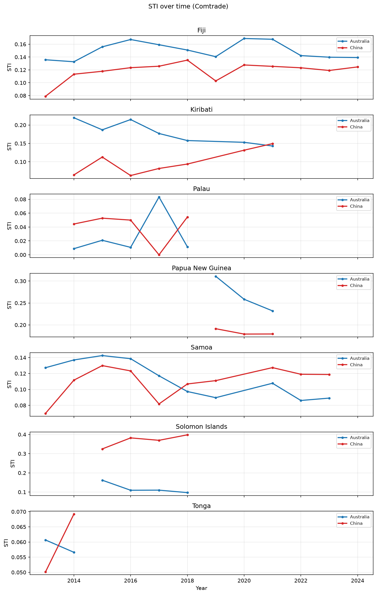

**Observations:**

- Fiji shows relatively stable dual exposure, with Australia usually slightly above China.
- Solomon Islands (2015–2018) shows a sharp China lead.
- PNG’s short window still shows Australia above China, with both elevated versus smaller PICs.
- Palau and Tonga remain low for both partners in the Comtrade extract.

### 7.2 Comtrade STI by partner (all countries on one chart)

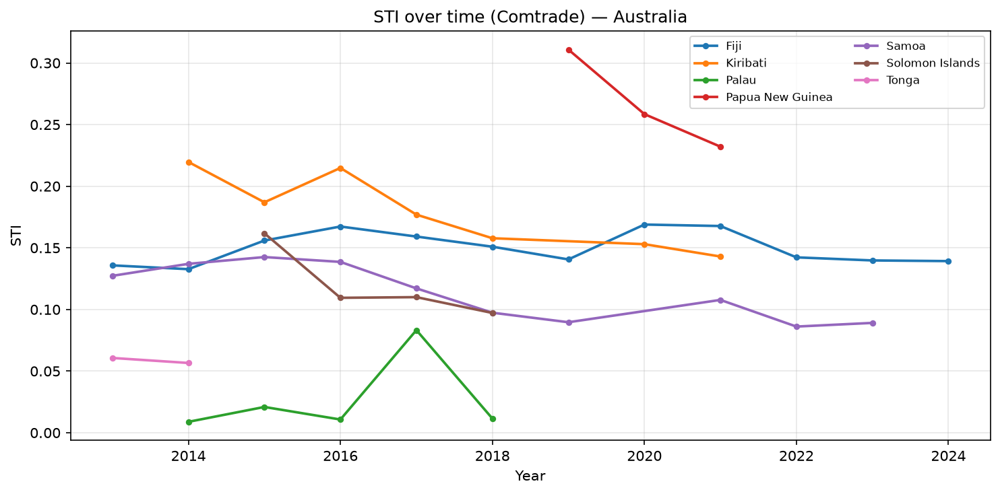

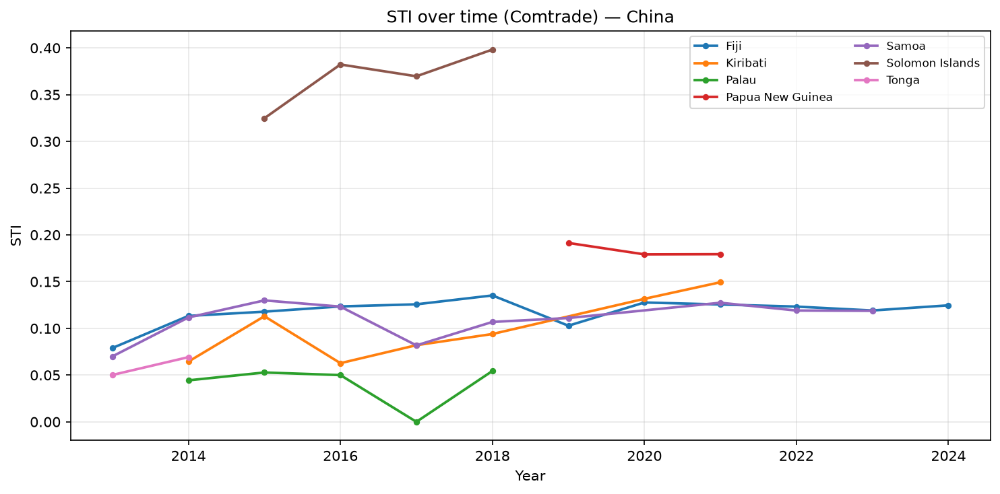

These views make cross-country ranking at a glance: PNG and Kiribati stand out for Australia; Solomon Islands stands out for China.

### 7.3 Comtrade CWTI over time

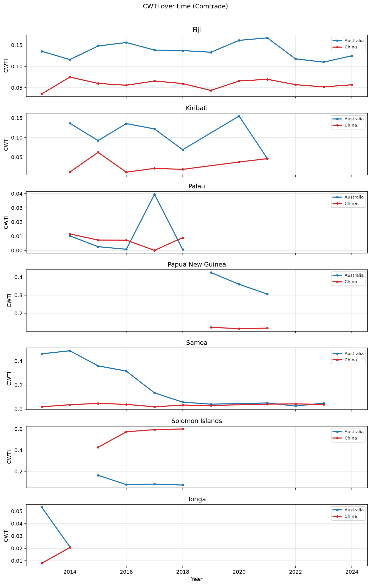

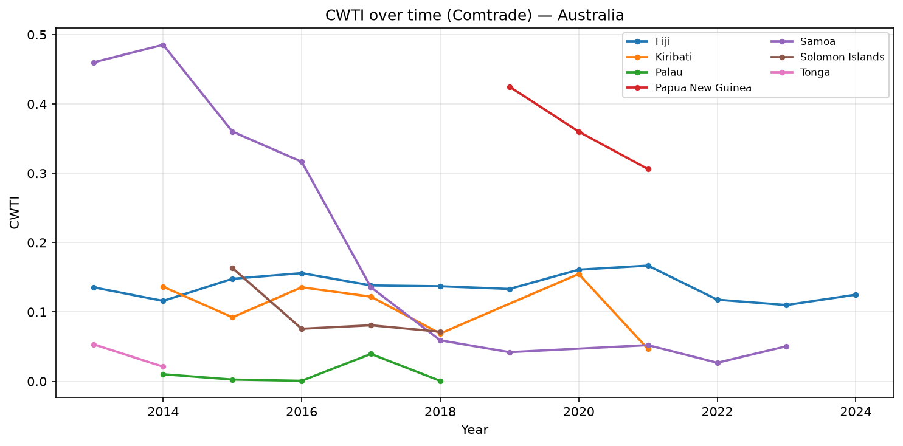

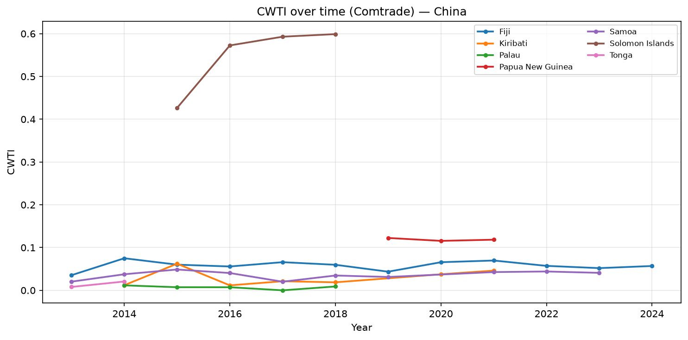

**STI vs CWTI reading guide**

| Pattern | Meaning |
| ------- | ------- |
| CWTI ≈ STI | Partner share is spread across commodities roughly in line with overall volume |
| CWTI ≫ STI | Partner dominates key chapters (higher “influence intensity”) |
| CWTI ≪ STI | Partner trade is large but more diversified across chapters |

Solomon Islands–China is the clearest **CWTI ≫ STI** case in Comtrade. Samoa–Australia also shows elevated CWTI relative to STI in several years.

### 7.4 IMF STI over time (by country; AUS / CHN / US)

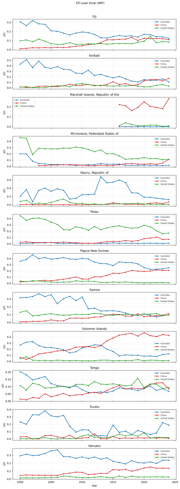

IMF’s longer window (from 2000) shows:

- Gradual shifts in partner shares rather than single-year spikes alone.
- Clear US lines for Palau and Micronesia.
- Persistent Australian leadership for several Melanesian economies.
- Rising or high China exposure for Solomon Islands (and episodically Marshall Islands).

### 7.5 IMF STI by partner

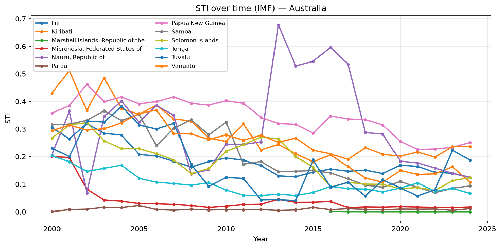

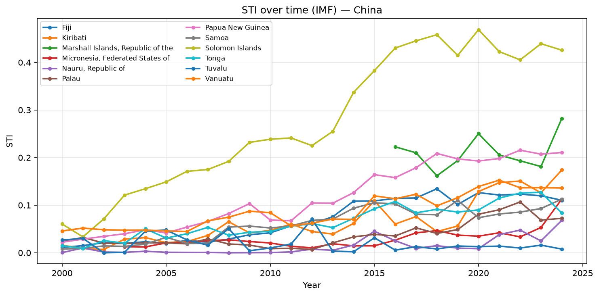

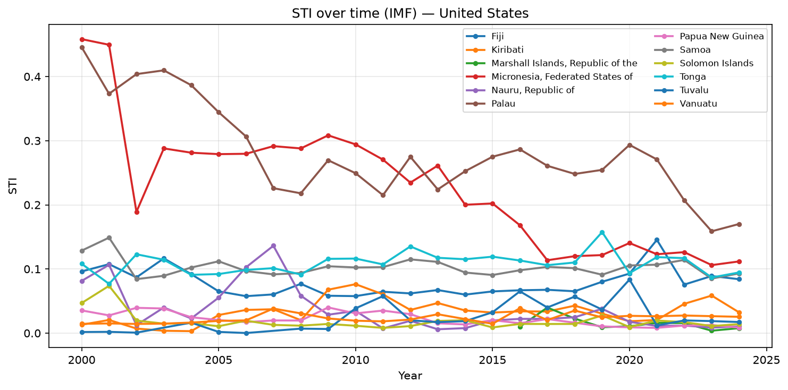

The US-by-partner chart isolates the North Pacific pattern: Palau and Micronesia remain high; Melanesian US STI stays low.

### 7.6 Overlay: Comtrade vs IMF STI

Solid lines = Comtrade; dashed = IMF. Partners = Australia and China only (shared partners).

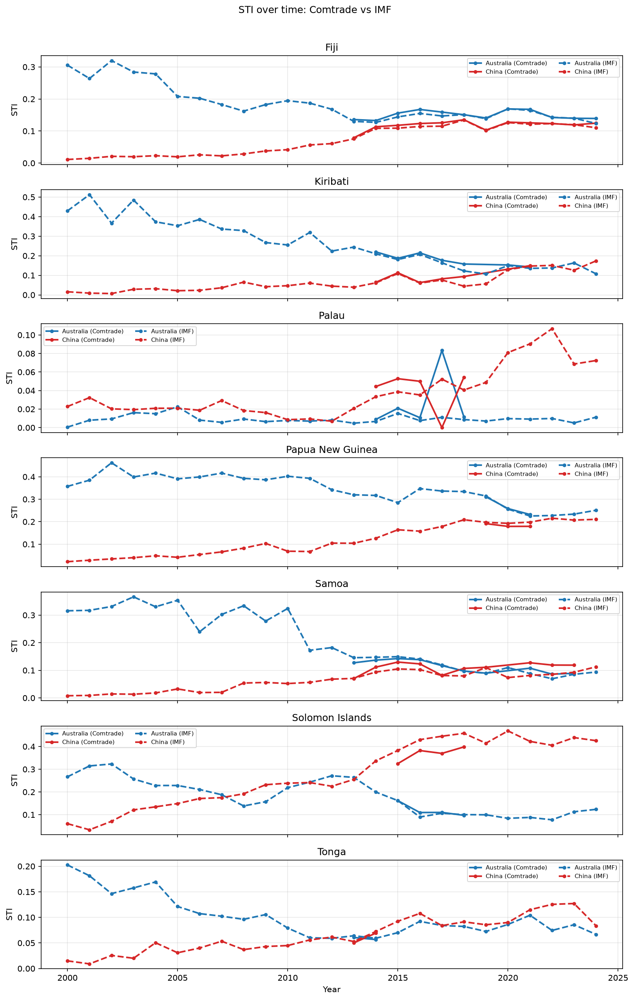

**Selected same-year comparisons**

| Country | Year | Partner | Comtrade STI | IMF STI |
| ------- | ---- | ------- | ------------ | ------- |
| Fiji | 2024 | Australia | 0.139 | 0.124 |
| Fiji | 2024 | China | 0.125 | 0.110 |
| Papua New Guinea | 2021 | Australia | 0.232 | 0.226 |
| Papua New Guinea | 2021 | China | 0.179 | 0.198 |
| Solomon Islands | 2018 | Australia | 0.097 | 0.100 |
| Solomon Islands | 2018 | China | 0.398 | 0.458 |

For these overlapping cases, levels are often close, but not identical — consistent with the separate Comtrade–IMF discrepancy analysis. Where they diverge, treat absolute STI levels with caution and emphasise **rankings and trends**.

---

## 8. Synthesis: influence patterns

### 8.1 Three partner “spheres” (IMF STI)

| Sphere | Typical PICs | Dominant partner |
| ------ | ------------ | ---------------- |
| Australian | PNG, Vanuatu, Nauru, Kiribati, Fiji, Samoa, Tuvalu | Australia |
| Chinese | Solomon Islands; episodically Marshall Islands | China |
| American | Palau, Micronesia | United States |

### 8.2 Where commodity concentration amplifies vulnerability (Comtrade CWTI)

| Link | Signal |
| ---- | ------ |
| Solomon Islands–China | Highest STI **and** CWTI → large share + concentrated chapters |
| PNG–Australia | High STI with even higher CWTI |
| Samoa–Australia | Moderate STI, elevated CWTI |
| Fiji–China | Moderate STI, much lower CWTI → more diversified China trade |

### 8.3 Data limitations (affect interpretation)

1. **No USA in Comtrade extract** — US influence measured only via IMF.
2. **No IMF commodities** — CWTI cannot be replicated on IMF.
3. **Uneven Comtrade years** — especially Tonga (2 years) and PNG (3 years).
4. **Source discrepancies** — STI levels can differ between Comtrade and IMF even in overlapping years (see discrepancy report).
5. **World totals** — must come from official world aggregates (`W00` / `*_world`); subsetting partners biases STI upward.

---

## 9. Conclusions

1. **STI is implementable on both Comtrade and IMF** with the same formula; IMF adds the US partner and longer history across 12 PICs.
2. **CWTI adds a commodity-concentration lens** available only in Comtrade: Solomon Islands–China and PNG–Australia emerge as high-intensity links beyond what STI alone shows.
3. **Partner spheres differ geographically**: Australia dominates much of Melanesia/South Pacific on IMF STI; China is strongest for Solomon Islands; the US dominates Palau and Micronesia.
4. **Time-series plots** are the primary visual product: country panels for narrative, partner panels for ranking, and Comtrade–IMF overlays for source sensitivity.
5. For policy or academic use, report **both STI and CWTI** where Comtrade exists, and use **IMF STI** for US comparisons and pre-2013 history — while documenting source disagreement where overlays diverge.

---

## 10. Appendix: figure and file inventory

### 10.1 Plots (`outputs/trade_influence/plots/`)

| File | Description |
| ---- | ----------- |
| `timeseries_sti_comtrade.png` | Comtrade STI by country (AUS vs CHN) |
| `timeseries_sti_comtrade_by_partner_aus.png` | Comtrade STI — Australia, all countries |
| `timeseries_sti_comtrade_by_partner_china.png` | Comtrade STI — China, all countries |
| `timeseries_cwti_comtrade.png` | Comtrade CWTI by country |
| `timeseries_cwti_comtrade_by_partner_aus.png` | Comtrade CWTI — Australia |
| `timeseries_cwti_comtrade_by_partner_china.png` | Comtrade CWTI — China |
| `timeseries_sti_imf.png` | IMF STI by country (AUS / CHN / US) |
| `timeseries_sti_imf_by_partner_aus.png` | IMF STI — Australia |
| `timeseries_sti_imf_by_partner_china.png` | IMF STI — China |
| `timeseries_sti_imf_by_partner_us.png` | IMF STI — United States |
| `timeseries_sti_comtrade_vs_imf.png` | Overlay Comtrade vs IMF STI |

### 10.2 Code entry points

| Path | Role |
| ---- | ---- |
| `scripts/run_trade_influence_analysis.py` | CLI |
| `notebooks/trade_influence_analysis.ipynb` | Interactive |
| `trade_influence/pipeline.py` | End-to-end `run_analysis` |
| `tests/test_trade_influence.py` | Unit + integration tests |
